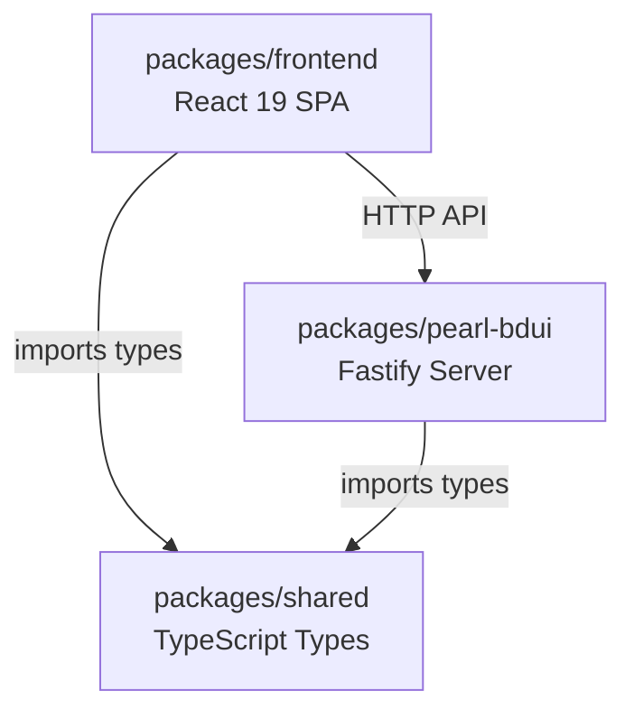
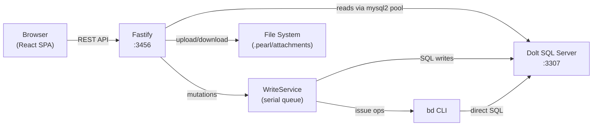

# Architecture

Pearl is a pnpm monorepo with three packages that together provide a rich web UI for the Beads issue tracker.

## Package Dependency Graph

`shared` must build first (`tsc` to `dist/`) since both `pearl-bdui` and `frontend` import its published types.

## Runtime Data Flow

## Key Architectural Decisions

### Write Serialization

All mutations flow through `WriteService`, which uses a `WriteQueue` to serialize writes. This prevents race conditions when the `bd` CLI and web UI write concurrently. After each write, the service emits `InvalidationHint` objects that tell the frontend which TanStack Query caches to refetch.

### Dolt Server Mode

Pearl requires Dolt running as a SQL server (not embedded mode). Two options:

- **Pearl-managed**: Pearl spawns and supervises a `dolt sql-server` subprocess. The `ServerManager` handles restarts on crashes (threshold: 3 consecutive failures).
- **External**: User runs their own `dolt sql-server` and provides host/port.

Embedded mode is deprecated (see [ADR-006](adr/006-deprecate-embedded-mode.md)). On first start with embedded data, Pearl shows a migration modal.

### Static Frontend Bundling

In production, the built frontend (`frontend-dist/`) is served by Fastify at `/` with SPA fallback (all non-API routes serve `index.html`). In development, Vite runs separately on port 5173 with a proxy to the backend.

## Package Details

### `packages/shared`

TypeScript-only package defining the API contract. Contains:
- Domain types: `Issue`, `IssueListItem`, `Dependency`, `Comment`, `Event`
- Enums: `IssueStatus`, `Priority`, `IssueType`, `DependencyType`, `LabelColor`
- Request/response types: `CreateIssueRequest`, `MutationResponse`, `HealthResponse`, etc.
- Attachment syntax parser: pill references (`@ref[title]`) and data blocks
- Validation constants: `ISSUE_STATUSES`, `ISSUE_TYPES`, `ISSUE_LIST_FIELDS`
- Default settings: attachment storage, encoding limits, sweep intervals

### `packages/pearl-bdui`

Node.js/Fastify backend, published to npm as `pearl-bdui`. Starts with `npx pearl-bdui`.

Key subsystems:
- **Routes** (`src/routes/`): Fastify route handlers with JSON Schema validation
- **Write Service** (`src/write-service/`): Serialized mutation pipeline
- **Dolt Pool** (`src/dolt/pool.ts`): mysql2 connection pooling with lock retry
- **Server Manager** (`src/dolt/server-manager.ts`): Dolt subprocess lifecycle
- **Orphan Sweep** (`src/orphan-sweep.ts`): Periodic cleanup of unreferenced attachments
- **Config** (`src/config.ts`): Auto-discovery of `.beads/metadata.json` for mode detection

### `packages/frontend`

React 19 SPA with:
- **Vite** for bundling
- **TailwindCSS v4** for styling
- **React Router v7** for client-side routing
- **TanStack Query** for server-state caching and invalidation
- **Base UI** for headless accessible components
- **@xyflow/react** + **dagre** for dependency graph visualization
- **@dnd-kit** for drag-and-drop on the Kanban board

Views: List (table), Board (kanban), Graph (DAG), Detail (editor), Settings, Setup.

## Environment Variables

| Variable | Default | Description |
|----------|---------|-------------|
| `PORT` | `3456` | Fastify server port |
| `DOLT_HOST` | `127.0.0.1` | Dolt SQL server host |
| `DOLT_PORT` | `3307` | Dolt SQL server port |
| `DOLT_USER` | `root` | Dolt SQL user |
| `DOLT_PASSWORD` | _(empty)_ | Dolt SQL password |
| `DOLT_DATABASE` | _(auto)_ | Database name (auto-detected from path or metadata) |
| `BEADS_DB_PATH` | _(auto)_ | Override `.beads/embeddeddolt/<db>/` path |
| `BD_PATH` | `bd` | Path to the `bd` CLI binary |
| `DOLT_PATH` | `dolt` | Path to the `dolt` binary |
| `LOG_LEVEL` | `info` | Pino log level (`debug`, `info`, `warn`, `error`) |
| `NODE_ENV` | _(unset)_ | Set to `production` to disable pretty-print logging |
