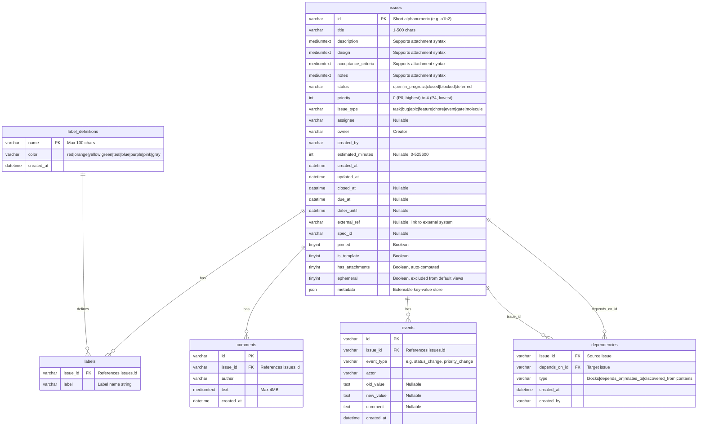

# Data Model

Pearl stores data in [Dolt](https://www.dolthub.com/), a MySQL-compatible database with Git-like version control. The schema is created by the `bd` CLI; Pearl extends it with additional columns and tables as needed.

## Entity-Relationship Diagram

## Table Details

### `issues`

The core table. Created and managed by the `bd` CLI. Pearl adds columns on startup:
- `has_attachments` (TINYINT): Auto-computed flag indicating whether any attachment-host field contains attachment syntax.
- Text field promotion: `description`, `design`, `acceptance_criteria`, `notes` are promoted from TEXT (64KB) to MEDIUMTEXT (16MB) to support inline base64 image attachments.

The `ephemeral` column marks temporary/wisp issues that are excluded from default list views.

### `labels`

Junction table implementing a many-to-many relationship between issues and label strings. An issue can have up to 50 labels.

### `label_definitions`

Stores the color assignment for each label name. Created by Pearl if it doesn't exist. The `color` field maps to a 9-color palette used by the frontend for rendering label badges.

### `comments`

Issue comments with author attribution. Ordered by `created_at ASC` (oldest first).

### `events`

Audit log for issue mutations. Each row records what changed (`event_type`), who changed it (`actor`), and the before/after values. Ordered by `created_at DESC` (newest first).

### `dependencies`

Directed graph edges between issues. Relationship types:

| Type | Semantics |
|------|-----------|
| `blocks` | Source blocks target from progressing |
| `depends_on` | Source depends on target being done |
| `relates_to` | Informational link, no blocking semantics |
| `discovered_from` | Source was discovered while working on target |
| `contains` | Parent-child (source contains target) |

The `bd` CLI historically used a `parent-child` type with reversed direction. Pearl normalizes these to `contains` on startup.

An issue with open `blocks` or `depends_on` dependencies where the target isn't closed is considered "blocked" (`is_blocked` structural filter).

## Connection Management

Pearl connects to Dolt via `mysql2/promise` with connection pooling (default pool size: 5).

Key behavior:
- **Lock retry**: On lock errors (MySQL error codes 1205, 1213), queries are retried up to 3 times with exponential backoff and jitter.
- **ROLLBACK before reads**: Each pooled connection runs `ROLLBACK` before queries to ensure it sees the latest committed data. This is necessary because Dolt's MVCC means a connection in a transaction sees a snapshot, and the `bd` CLI may commit data between Pearl's reads.

## Attachment Storage

Attachments are stored on the local file system, not in the database. The database tracks only the `has_attachments` boolean flag.

Storage locations:
- **Project scope** (default): `<project>/.pearl/attachments/YYYY/MM/<ref>.<ext>`
- **User scope**: `~/.pearl/attachments/<project-name>/YYYY/MM/<ref>.<ext>`

Files are content-addressed by SHA-256 hash (first 12 hex chars = ref). Duplicate uploads are deduplicated. An orphan sweep runs periodically to delete files no longer referenced in any issue field.

## Dolt-Specific Features

Dolt provides Git-like version control for the database. All writes are committed to a Dolt branch, enabling:
- Full history of every row change
- `dolt diff` between any two points in time
- `dolt log` for commit history
- Branch-based workflows for data
- `dolt push` to sync with remote repositories
