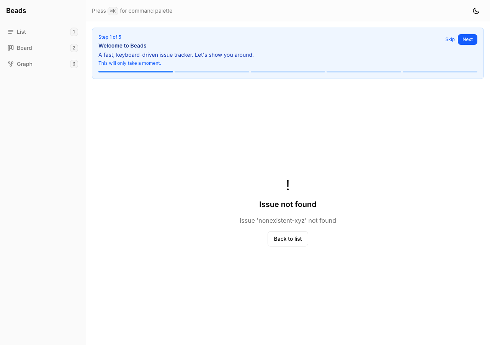

# Proof: beads-gui-513 — Comprehensive error boundary with retry

## Evidence

### 01 — Issue not found state

- Error state for nonexistent issue shows clear "Issue not found" message
- Shows specific error message with the issue ID
- "Back to list" button for recovery

## Implementation details
- Error categorization: network, not_found, unexpected
- Each category has unique icon, title, and recovery suggestion
- `inline` prop for per-component compact error boundaries
- Collapsible error details (for unexpected errors only)
- "Try Again" and "Reload Page" recovery actions
- Retry count tracked internally

## Acceptance criteria
| Criterion | Status |
|-----------|--------|
| Categorize errors (network, not_found, unexpected) | PASS |
| Contextual recovery actions per error type | PASS |
| Per-component error boundaries (inline mode) | PASS |
| Retry functionality | PASS |
| Reload page option | PASS |
| Error details expandable | PASS |
