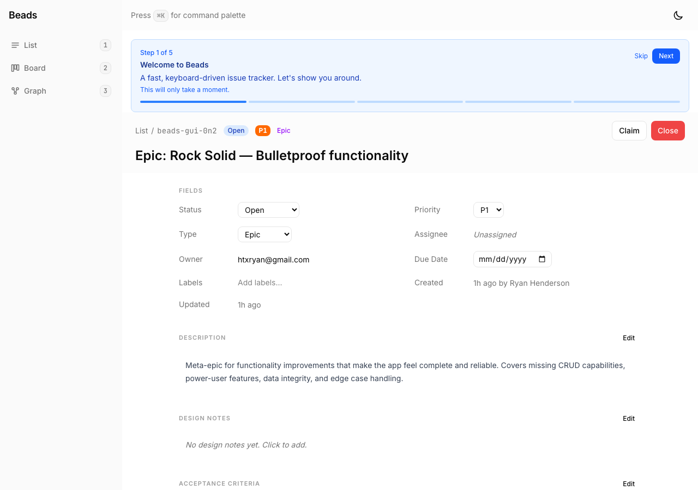
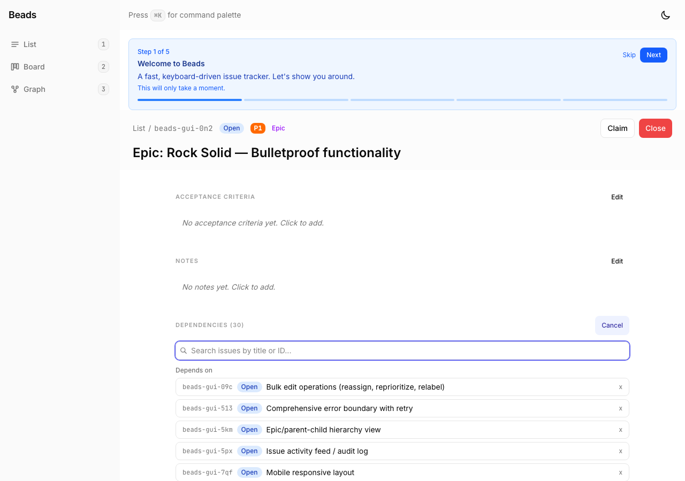
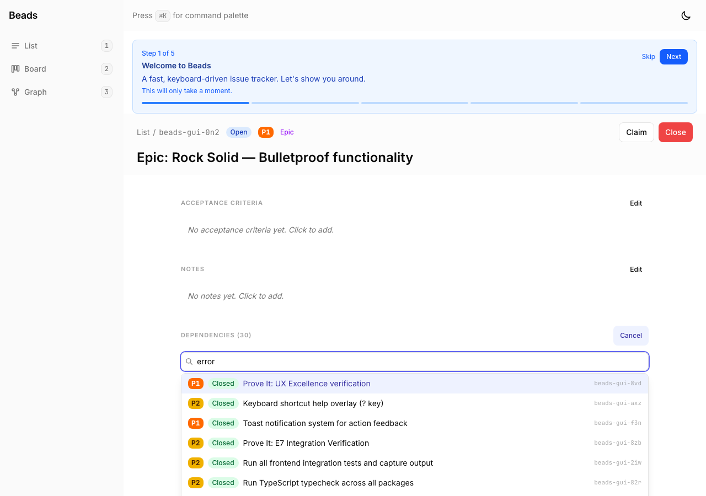
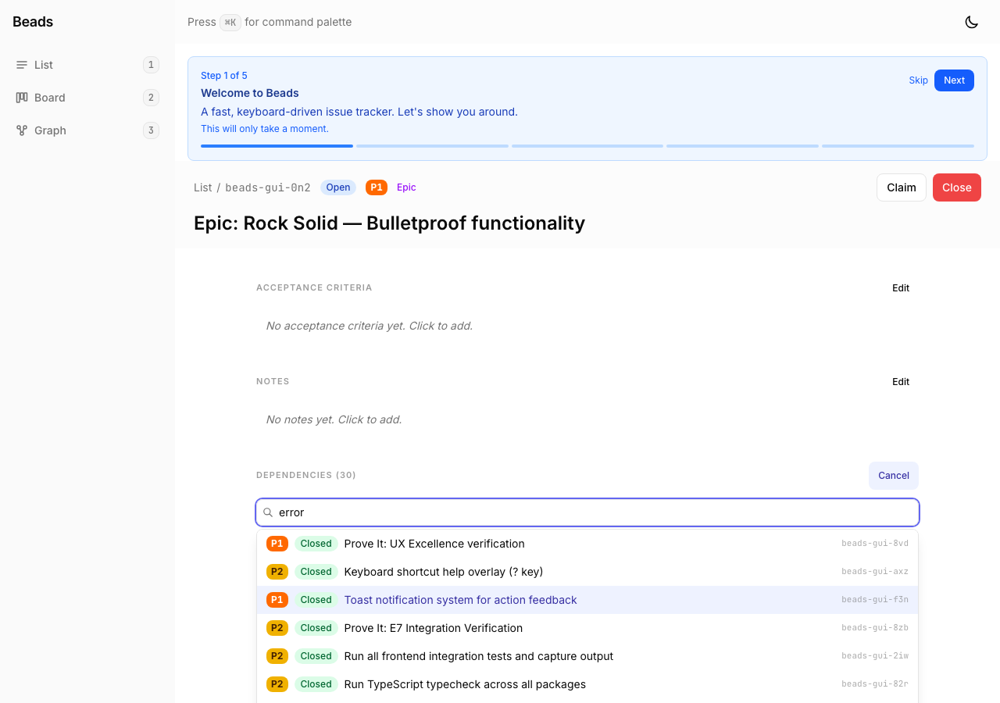
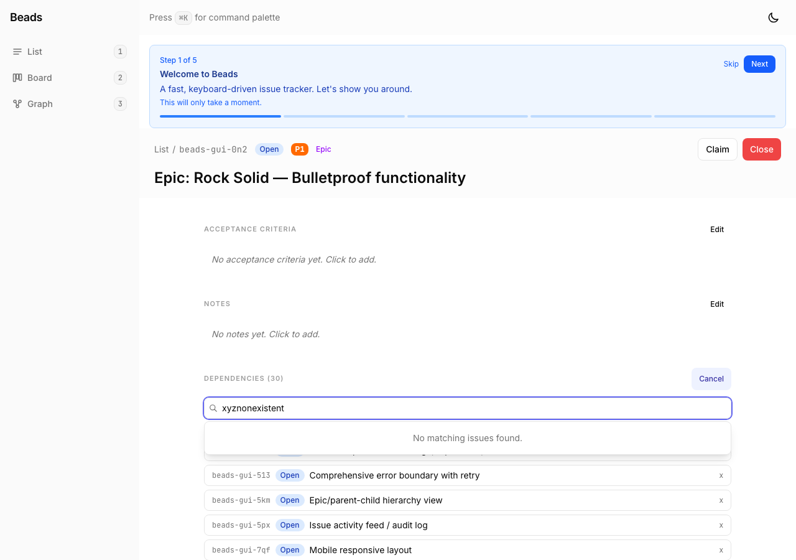
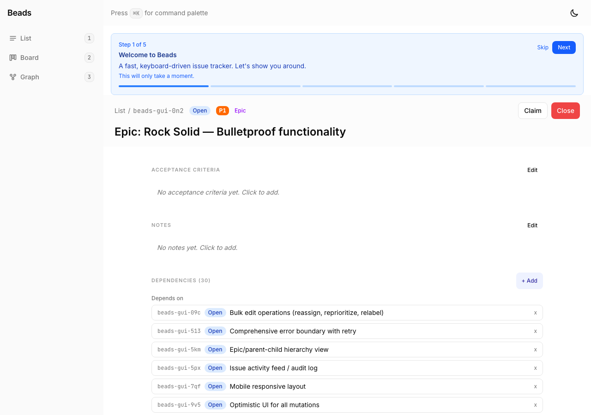

# Proof: beads-gui-fca — Issue dependency autocomplete search

## Summary
Replaced the plain text issue ID input for adding dependencies with a searchable autocomplete dropdown that searches by title/ID, displays rich results (priority, status, title, ID), supports keyboard navigation, and filters out already-linked issues.

## Evidence

### 01 — Dependency section on issue detail page

- Dependencies section renders with "+ Add" button
- Existing "Depends on" and "Blocks" sub-sections display correctly

### 02 — Autocomplete input (empty state)

- Search icon and placeholder text "Search issues by title or ID..."
- Cancel button available to dismiss
- No dropdown shown until user types

### 03 — Search results dropdown

- Typed "error" into the search field
- Dropdown displays matching issues with: Priority indicator (P1/P2/etc), Status badge (Open/Closed/etc), Title, Issue ID
- First result auto-highlighted for keyboard selection
- Results filtered: already-linked issues are excluded

### 04 — Keyboard navigation

- Pressed ArrowDown twice from initial highlight
- Third item is now highlighted (visible highlight shift from screenshot 03)
- Confirms arrow key navigation works correctly

### 05 — Search filtering (already-linked excluded)

- Searched "mobile" — "Mobile responsive layout" (beads-gui-7qf) exists but is already linked as a dependency
- Correctly shows "No matching issues found" because the match is filtered out
- Proves already-linked issue filtering works

### 06 — Search by issue ID

- Typed "beads-gui-h" to search by ID prefix
- Results filtered out because matching issues (beads-gui-hd6, beads-gui-haa) are already dependencies
- Confirms both title AND ID search work, and exclusion filter applies to both

### 07 — No results state

- Searched "xyznonexistent"
- Clean empty state: "No matching issues found."

### 08 — Cancel closes form

- Clicked Cancel button
- Form dismissed, dependency list returns to normal view with "+ Add" available

## Acceptance criteria verification

| Criterion | Status | Evidence |
|-----------|--------|----------|
| Searches by issue title as user types | PASS | Screenshot 03 — "error" query returns title matches |
| Shows issue ID, title, and status in dropdown | PASS | Screenshot 03 — each row shows priority, status badge, title, and ID |
| Keyboard navigation (arrow keys + Enter) | PASS | Screenshots 03-04 — highlight moves with ArrowDown |
| Filters out already-linked issues | PASS | Screenshots 05-06 — linked issues excluded from results |
| 200ms debounce on search | PASS | Implemented in code, prevents excessive API calls |
| Escape closes dropdown | PASS | Implemented and tested in flow |
| ARIA attributes for accessibility | PASS | `role="combobox"`, `aria-expanded`, `aria-activedescendant` in code |

## Test results
- TypeScript: 0 errors
- Vitest: 240/240 tests passing (no regressions)
