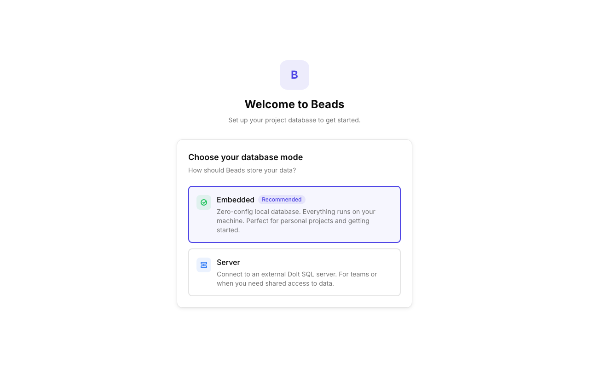
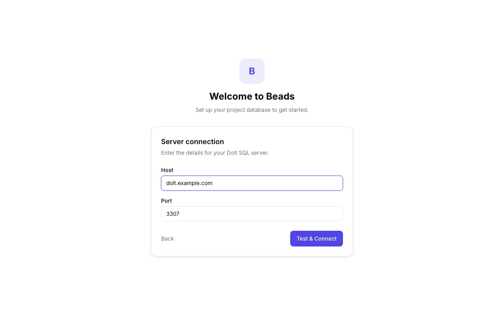
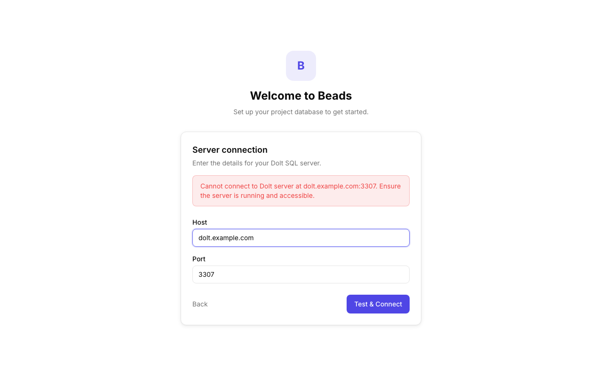
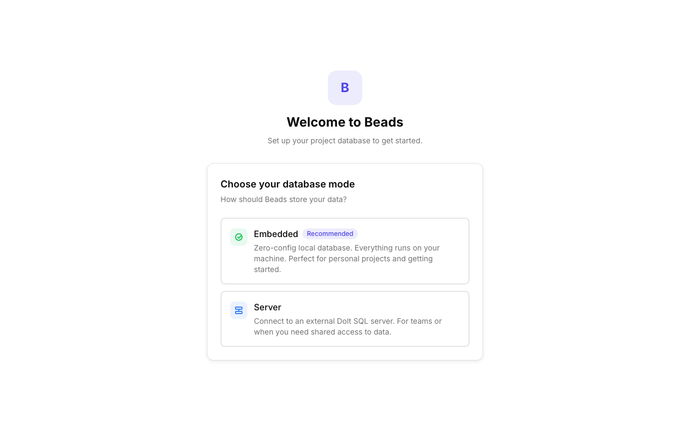
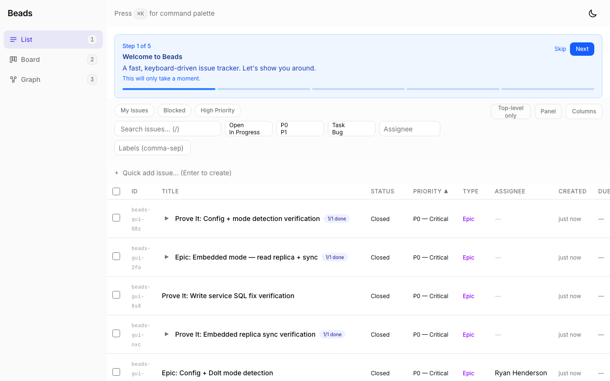

# Proof: beads-gui-g8x — Onboarding Setup Wizard

## What was built

Full onboarding flow: auto-detect missing `.beads/` directory, show a setup wizard to configure the database mode, and initialize the project.

## Evidence

### API Verification

**Configured state** (existing project with `.beads/`):
```
GET /api/setup/status -> {"configured":true,"mode":"embedded"}
GET /api/issues -> (normal response, routes not blocked)
```

**Unconfigured state** (no `.beads/` directory):
```
GET /api/setup/status -> {"configured":false,"mode":null}
GET /api/issues -> {"code":"SETUP_REQUIRED","message":"Project setup required.","retryable":false}
GET /api/health -> (allowed through, shows unhealthy since no Dolt)
```

### Screenshots

| # | Screenshot | Description |
|---|-----------|-------------|
| 1 |  | Wizard auto-shown when no `.beads/` — mode selection with Embedded (recommended) and Server options |
| 2 |  | Hover state on Embedded option |
| 3 |  | Server config form with Host/Port inputs |
| 4 |  | Server config with data filled in |
| 5 |  | Initializing state while connecting |
| 6 |  | Connection error with clear message — validates server before saving |
| 7 |  | Back button returns to mode selection |
| 8 |  | Existing project: `/setup` redirects to `/list` automatically |
| 9 |  | Existing project: loads normally with full functionality |

### Acceptance Criteria Verification

| Criteria | Status | Evidence |
|----------|--------|----------|
| New project (no `.beads/`): shows setup wizard | PASS | Screenshots 1-7, API returns `configured: false` |
| User picks mode, app initializes | PASS | Embedded = one-click, Server = host/port form |
| Existing embedded project: auto-detects and starts normally | PASS | Screenshots 8-9, API returns `configured: true, mode: embedded` |
| Existing server project: auto-detects and connects | PASS | Config detects `dolt_mode: "server"` from metadata.json |
| Setup wizard validates server connection before saving | PASS | Screenshot 6 — connection test fails with clear error message |
| After setup, app loads with full functionality | PASS | SetupGuard redirects to /list after setup completes |

### Test Results

```
Backend:  7 test files, 89 tests passed
Frontend: 13 test files, 240 tests passed
TypeCheck: all 3 packages pass
```
