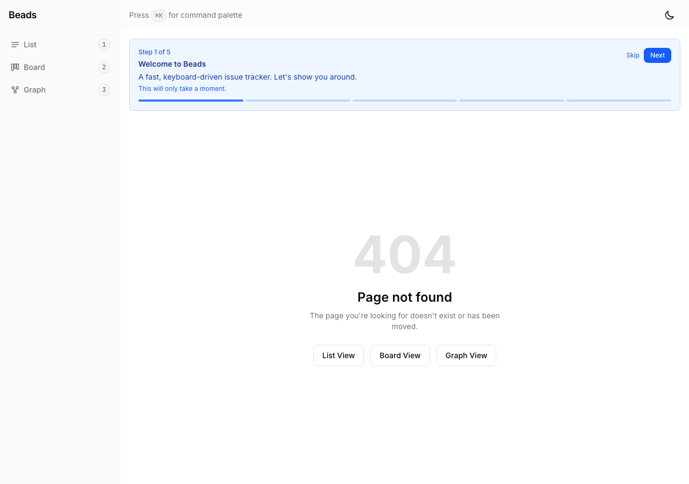

# Proof: beads-gui-haa — Designed 404 page

## Evidence

### 01 — 404 page

- Large "404" visual indicator
- "Page not found" heading with helpful description
- Navigation links to List, Board, and Graph views
- Replaces previous silent redirect to /list

## Acceptance criteria
| Criterion | Status |
|-----------|--------|
| Clear "Page not found" message | PASS |
| Visual indicator (large 404) | PASS |
| Navigation links to all views | PASS |
| Renders within app shell (sidebar visible) | PASS |
