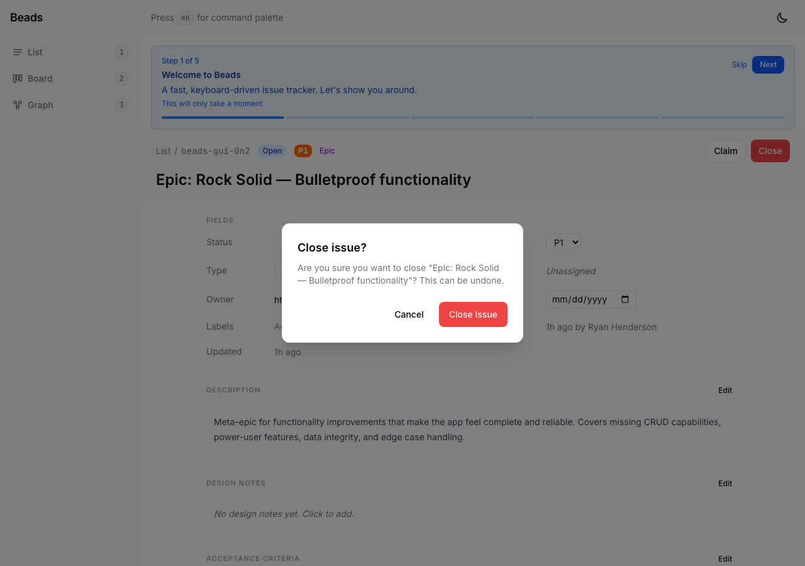
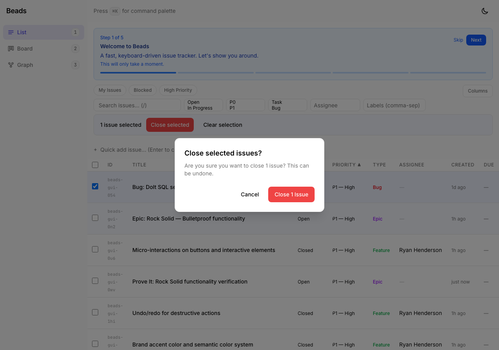
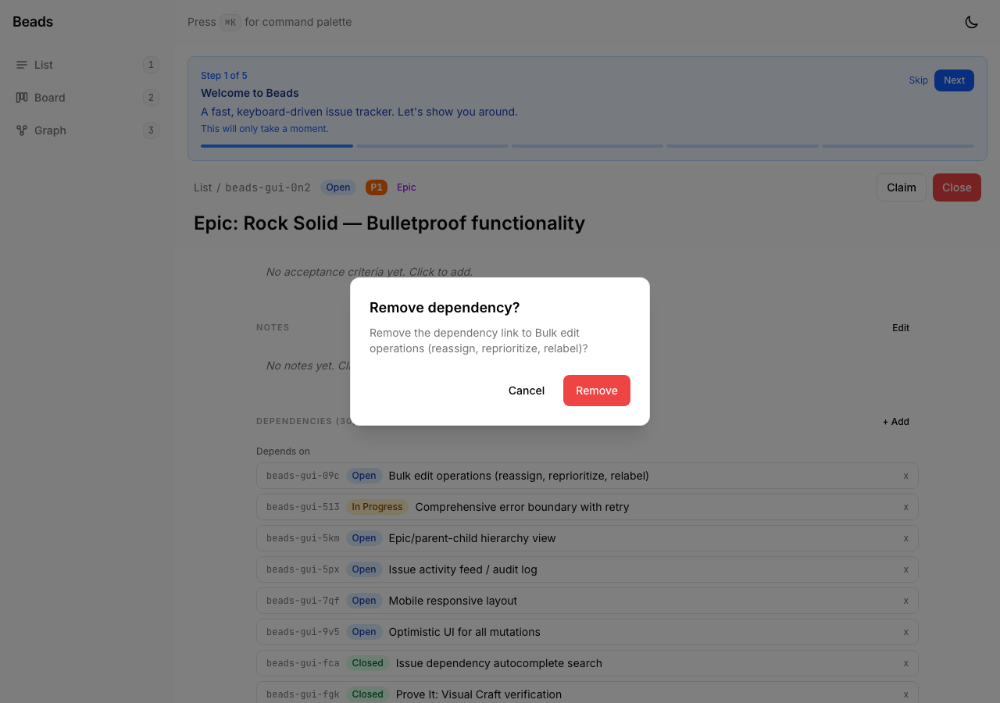

# Proof: beads-gui-sh4 — Confirmation dialogs for destructive actions

## Evidence

### 01 — Close issue confirmation dialog

- Clicking "Close" on issue detail shows "Close issue?" dialog with issue title
- Cancel and "Close Issue" buttons, focus defaults to Cancel (safe default)

### 02 — Bulk close confirmation dialog

- Selecting issues and clicking "Close selected" shows count-aware dialog
- Dynamic label: "Close 1 Issue" (pluralizes correctly)

### 03 — Remove dependency confirmation

- Clicking "x" on a dependency row shows "Remove dependency?" dialog
- Shows the target issue title in the description

## Acceptance criteria
| Criterion | Status |
|-----------|--------|
| Close individual issues — shows title | PASS |
| Bulk close — shows count | PASS |
| Remove dependencies — confirmation | PASS |
| Keyboard-navigable (Escape to cancel) | PASS |
| Accessible (dialog element, focus management) | PASS |
| Tests updated and passing (240/240) | PASS |
