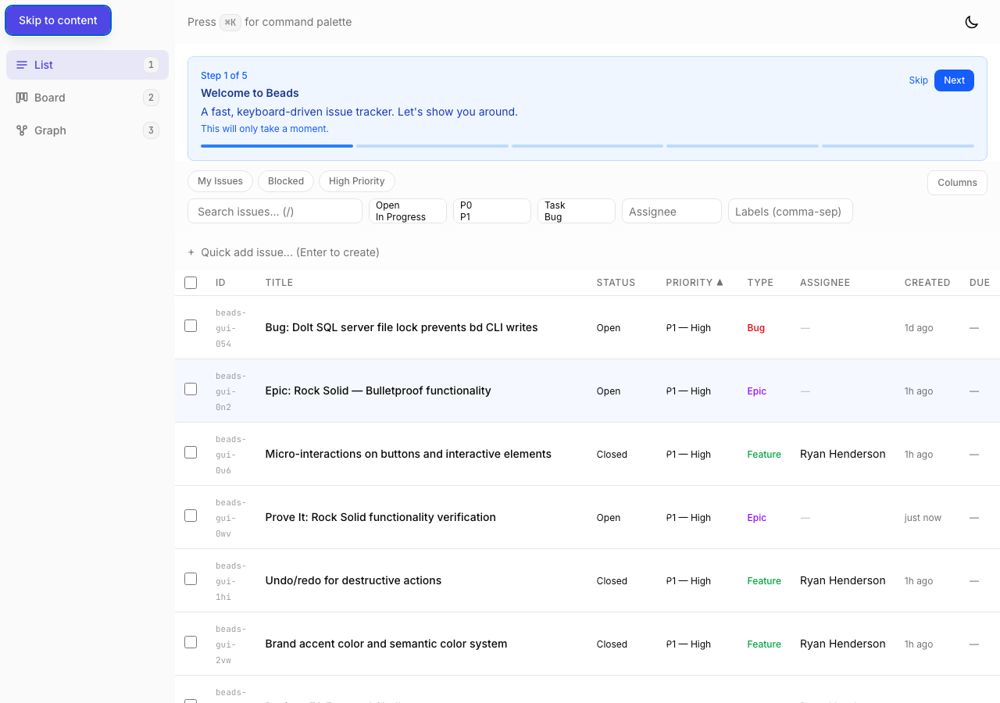

# Proof: beads-gui-v72 — Accessible focus management on route changes

## Evidence

### 01 — Skip to content link

- "Skip to content" link visible in top-left when Tab is pressed
- Styled with primary color, appears above all content

### 02 — Main content focusable

- `#main-content` element has `tabindex="-1"` (confirmed -1 in script output)
- Focus moves to main content on route changes
- `outline-none` class prevents visible focus ring on programmatic focus

## Implementation details
- `useRouteAnnouncer` hook tracks location changes
- `aria-live="polite"` div announces "Navigated to [view name]" on route changes
- Skip-to-content link uses `sr-only` + `focus:not-sr-only` pattern
- First render skipped to avoid announcing initial page load

## Acceptance criteria
| Criterion | Status |
|-----------|--------|
| Focus moved to main content on route change | PASS |
| Skip-to-content link | PASS |
| aria-live announcements for route changes | PASS |
| No visible focus ring on programmatic focus | PASS |
