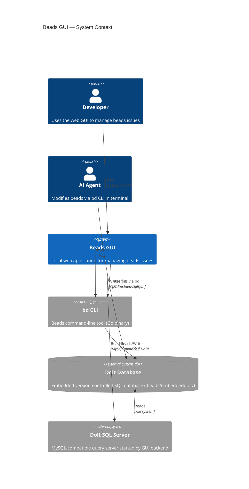
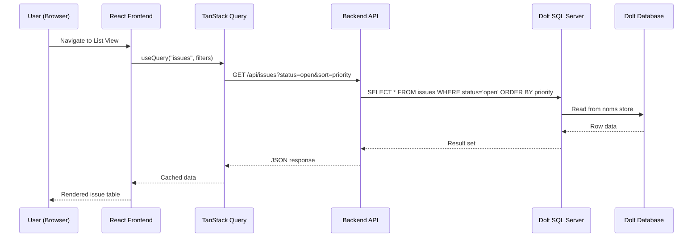
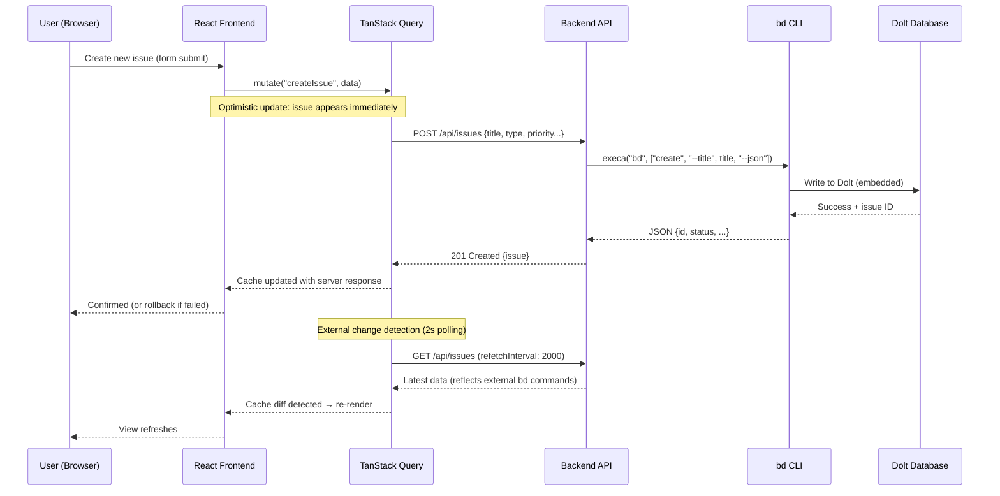
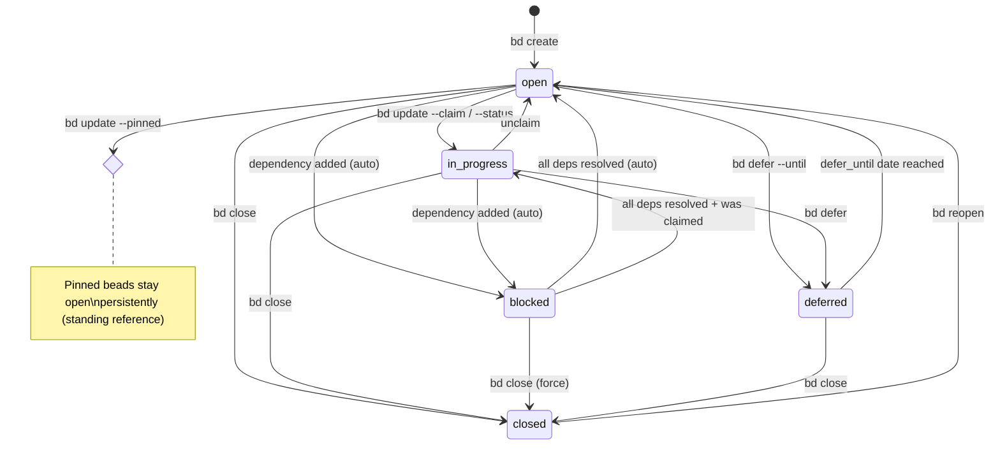

# Beads GUI — System Specification

**Version**: 1.1 (post-advisory)  
**Date**: 2026-04-10  
**Status**: Approved  
**Delivery Profile**: `webapp` (advisory — each epic defines its own verification contract)

## 1. Overview

A rich, local web GUI for the **beads** AI agent work management system. Provides a JIRA-like interface for viewing, creating, editing, and managing beads issues with full keyboard navigation, dependency graph visualization, and multiple view modes.

The GUI runs locally, reads from the Dolt SQL database for performance, and writes through the `bd` CLI for data integrity.

### Design Note

This system is user-facing and design-critical. Applicable epics should invoke `/compound:build-great-things` during their work phase for:
- Information architecture (navigation, hierarchy, filtering)
- Visual design (typography, color, spacing, states, motion)
- Software design philosophy (deep modules, complexity management)
- Keyboard-first interaction design
- Accessibility compliance

## 2. Domain Glossary

| Term | Definition |
|------|-----------|
| **Bead** | An issue/work item — the atomic unit of tracked work |
| **Dolt** | Version-controlled SQL database powering beads storage |
| **Dependency** | A directed edge in the DAG between two beads |
| **Gate** | An async coordination bead that blocks until a condition is met |
| **Molecule** | A reusable work template instantiated via "pour" |
| **Wisp** | An ephemeral bead with TTL-based lifecycle |
| **Epic** | A large body of work spanning multiple child beads |
| **Claim** | Atomically assigning + setting `in_progress` |
| **Ready** | A bead with no unmet dependencies |
| **Blocked** | A bead with at least one unmet dependency |

## 3. EARS Requirements

### 3.1 Ubiquitous (Always True)

| ID | Requirement |
|----|------------|
| U1 | The system SHALL display beads issues in a tabular list with sorting and filtering capabilities |
| U2 | The system SHALL support full keyboard navigation for all operations including view switching, issue selection, field editing, and modal interaction |
| U3 | The system SHALL persist all write operations through the `bd` CLI to maintain data integrity and audit trail consistency |
| U4 | The system SHALL run as a local web application accessible via browser without requiring internet connectivity |
| U5 | The system SHALL read issue data from the Dolt SQL database via a local `dolt sql-server` for query performance |
| U6 | The system SHALL display issue status, priority, type, and assignee using distinct visual indicators |
| U7 | The system SHALL maintain a responsive layout that works at viewport widths from 1024px to 2560px |
| U8 | The system SHALL provide a command palette accessible via `Cmd+K` / `Ctrl+K` for quick actions |

### 3.2 Event-Driven

| ID | Requirement |
|----|------------|
| E1 | WHEN the user creates an issue through the GUI, the system SHALL invoke `bd create` with the specified parameters and refresh the affected views |
| E2 | WHEN the user changes an issue's status, the system SHALL invoke `bd update` and update all views reflecting that issue's state |
| E3 | WHEN the user adds or removes a dependency, the system SHALL invoke `bd dep add/remove` and refresh the dependency graph |
| E4 | WHEN the underlying Dolt database changes externally (e.g., another `bd` command in a terminal), the system SHALL detect the change within 2 seconds via polling and refresh the display |
| E5 | WHEN the user drags an issue card to a different Kanban column, the system SHALL invoke `bd update --status=<new_status>` |
| E6 | WHEN the user applies a filter or search query, the system SHALL query the Dolt SQL database and update results within 200ms for datasets under 10,000 issues |
| E7 | WHEN the user presses a keyboard shortcut, the system SHALL execute the bound action immediately |
| E8 | WHEN the user closes an issue, the system SHALL invoke `bd close` and highlight any newly-unblocked issues |
| E9 | WHEN the user adds a comment, the system SHALL invoke `bd comment` and append the comment to the activity timeline |

### 3.3 State-Driven

| ID | Requirement |
|----|------------|
| S1 | WHILE in List View, the system SHALL display issues in a sortable, filterable data table with configurable visible columns |
| S2 | WHILE in Kanban View, the system SHALL display issues as cards grouped into columns by status with drag-and-drop reordering |
| S3 | WHILE in Graph View, the system SHALL render an interactive dependency DAG with zoom, pan, and click-to-navigate |
| S4 | WHILE an Issue Detail panel is open, the system SHALL show all fields, comments, activity timeline, and dependency links with inline editing |
| S5 | WHILE a filter is active, the system SHALL show only matching issues and display the active filter criteria with a clear button |
| S6 | WHILE the Dolt SQL server is starting or unavailable, the system SHALL display an error state with instructions to restart, and disable data-dependent views |

### 3.4 Unwanted (Error Handling)

| ID | Requirement |
|----|------------|
| W1 | IF a `bd` CLI write operation fails, the system SHALL display the error message to the user, NOT silently discard the change, and offer a retry option |
| W2 | IF the beads database is locked by another process, the system SHALL notify the user with the locking process info and retry after 1 second (up to 3 retries) |
| W3 | IF the user navigates away from an issue with unsaved inline edits, the system SHALL warn before discarding changes |
| W4 | IF the Dolt SQL server crashes, the system SHALL automatically attempt to restart it and display an error state until it recovers |

### 3.5 Optional (Configurable)

| ID | Requirement |
|----|------------|
| O1 | WHERE configured, the system SHALL display custom issue types and statuses beyond the defaults |
| O2 | WHERE configured, the system SHALL use custom keyboard shortcuts instead of default bindings |
| O3 | WHERE multiple beads repos are configured, the system SHALL allow switching between repos via a selector |
| O4 | WHERE configured, the system SHALL apply a custom theme (light/dark/custom colors) |
| O5 | WHERE configured, the system SHALL persist view preferences (column order, widths, sort, filters) per repo |

## 4. Architecture

### 4.1 C4 Context Diagram



### 4.2 Component Architecture

```
┌─────────────────────────────────────────────────┐
│                    Browser                       │
│  ┌─────────────────────────────────────────────┐│
│  │            React SPA (Vite)                 ││
│  │  ┌──────────┐ ┌──────────┐ ┌─────────────┐ ││
│  │  │ List View│ │Board View│ │ Graph View  │ ││
│  │  └────┬─────┘ └────┬─────┘ └──────┬──────┘ ││
│  │       │             │              │        ││
│  │  ┌────▼─────────────▼──────────────▼──────┐ ││
│  │  │  TanStack Query (Cache + 2s polling)   │ ││
│  │  └────────────────┬───────────────────────┘ ││
│  └───────────────────┼─────────────────────────┘│
│                      │ HTTP                      │
└──────────────────────┼───────────────────────────┘
                       │
┌──────────────────────┼───────────────────────────┐
│      Node.js Backend (Fastify @ 127.0.0.1)       │
│  ┌───────────────────▼───────────────────────┐   │
│  │              REST API Router               │   │
│  │    GET /issues  POST /issues  etc.        │   │
│  └──────┬──────────────────────┬─────────────┘   │
│         │ reads                │ writes           │
│  ┌──────▼──────┐     ┌────────▼─────────┐        │
│  │ Dolt SQL    │     │  Write Service   │        │
│  │ Client      │     │  (shared module) │        │
│  │ (mysql2)    │     │  execa array-arg │        │
│  └──────┬──────┘     └────────┬─────────┘        │
│         │                     │                   │
│  ┌──────▼──────┐     ┌────────▼─────────┐        │
│  │dolt sql-svr │     │   bd CLI binary  │        │
│  │ (managed)   │     │                  │        │
│  └──────┬──────┘     └────────┬─────────┘        │
│         │                     │                   │
│  ┌──────▼─────────────────────▼─────────┐        │
│  │    .beads/embeddeddolt/<db>/          │        │
│  │    (Dolt database files)             │        │
│  └──────────────────────────────────────┘        │
└───────────────────────────────────────────────────┘
```

### 4.3 Read Path — Sequence Diagram



### 4.4 Write Path — Sequence Diagram



### 4.5 Issue Lifecycle — State Diagram



## 5. Technology Stack

| Layer | Technology | Rationale |
|-------|-----------|-----------|
| **Frontend Framework** | React 19 + Vite | Largest ecosystem, best keyboard/a11y libraries |
| **Styling** | Tailwind CSS 4 | Utility-first, rapid iteration |
| **Components** | shadcn/ui (Base UI) | shadcn's Base UI integration — accessible primitives with full design control |
| **Data Grid** | TanStack Table v8 | Headless, virtualized, full keyboard support |
| **Server State** | TanStack Query v5 | Caching, invalidation, optimistic updates, 2s polling for external change detection |
| **Client State** | React useState/useContext | Sufficient for UI state (selections, panel state, filters) at this scale |
| **Routing** | React Router v7 | Industry standard, keyboard-navigable |
| **Graph Rendering** | React Flow | Interactive DAG with built-in zoom/pan (cap: ~200 nodes, filtered subgraph beyond) |
| **Drag & Drop** | dnd-kit | Accessible, keyboard-aware DnD |
| **Command Palette** | cmdk | Cmd+K palette, keyboard-first |
| **Markdown** | react-markdown + remark | For description/notes rendering |
| **Backend** | Node.js + Fastify (bound to 127.0.0.1) | Fast, lightweight, TypeScript-first, localhost-only |
| **SQL Client** | mysql2 | MySQL-compatible driver for Dolt |
| **Process Management** | execa (array-form args only) | Spawn bd CLI — MUST use array args, never string interpolation |

### Removed from Original Spec (Post-Advisory)
- **chokidar / WebSocket**: Replaced with 2s TanStack Query `refetchInterval` polling (same E4 SLA, far simpler)
- **Zustand**: React's own state primitives sufficient at this scale; add later if a cross-cutting need emerges
- **CLI fallback reads**: If Dolt SQL is down, show error state rather than maintaining a parallel read path
- **Wisps**: Explicitly out of scope for v1 (wisp_* tables exist in schema but have no GUI representation)

## 6. Dolt SQL Schema (Read Layer)

### Primary Tables

| Table | Purpose | Key Fields |
|-------|---------|-----------|
| `issues` | All beads issues | id, title, description, status, priority, issue_type, assignee, created_at, due_at, defer_until |
| `dependencies` | Issue relationships | issue_id, depends_on_id, type (blocks/depends-on/relates-to/...) |
| `comments` | Issue comments | id, issue_id, author, text, created_at |
| `labels` | Issue tags | issue_id, label |
| `events` | Change history | id, issue_id, event_type, actor, old_value, new_value, created_at |
| `metadata` | Key-value config | key, value |

### Computed Views

| View | Purpose |
|------|---------|
| `ready_issues` | Issues with no open blockers (same schema as issues) |
| `blocked_issues` | Issues with open blockers + `blocked_by_count` |

### Ephemeral Tables (Out of Scope for v1)

| Table | Purpose |
|-------|---------|
| `wisps` | Ephemeral short-lived beads |
| `wisp_dependencies` | Wisp relationships |
| `wisp_comments` | Wisp comments |
| `wisp_events` | Wisp change history |
| `wisp_labels` | Wisp tags |

> These tables exist in the Dolt schema but are explicitly excluded from the v1 GUI.

## 7. Scenario Table

| ID | Scenario | EARS Ref | Input | Expected Outcome |
|----|----------|----------|-------|-----------------|
| SC1 | View all open issues | U1, S1 | Navigate to List View | Table shows all issues with status=open, sorted by priority |
| SC2 | Create a new task | E1, U3 | Fill form, submit | `bd create` invoked, issue appears in list |
| SC3 | Claim an issue | E2, U3 | Click "Claim" on issue | `bd update --claim` invoked, status changes to in_progress |
| SC4 | Add a dependency | E3 | Select "Add Dependency" on issue | `bd dep add` invoked, graph updates |
| SC5 | Drag card on Kanban | E5, S2 | Drag issue to "In Progress" column | `bd update --status=in_progress` invoked |
| SC6 | Filter by label | E6, S5 | Type label in filter bar | SQL WHERE clause applied, table filters instantly |
| SC7 | External change detection | E4 | Run `bd create` in terminal | GUI detects file change, refreshes within 2s |
| SC8 | Close issue, unblock others | E8 | Click "Close" | `bd close` invoked, newly-unblocked issues highlighted |
| SC9 | Use command palette | U8, E7 | Press Cmd+K, type "create" | Command palette opens, "Create Issue" action available |
| SC10 | View dependency graph | S3 | Switch to Graph View | DAG renders with all issues as nodes, deps as edges |
| SC11 | Inline edit title | S4, W3 | Click issue title, edit, press Escape | Warning dialog: "Discard changes?" |
| SC12 | Database locked | W2 | Another process holds lock | "Database locked" notification, auto-retry |
| SC13 | Switch view with keyboard | U2, E7 | Press `1`/`2`/`3` | View switches to List/Board/Graph |
| SC14 | Dolt server unavailable | S6, W4 | SQL server crashes | Error state shown, auto-restart attempted, views disabled until recovery |
| SC15 | Custom keyboard shortcut | O2 | Configure `n` → "New Issue" | Pressing `n` opens create dialog |
| SC16 | Search issues | E6 | Type in search bar | Full-text search via SQL, results update live |
| SC17 | View issue history | S4 | Open issue detail, scroll to "Activity" | Events table shows all changes with timestamps |
| SC18 | Add comment | E9 | Type comment, submit | `bd comment` invoked, comment appears in timeline |
| SC19 | Bulk close issues | E2, E8 | Select multiple, click "Close Selected" | `bd close id1 id2 ...` invoked |
| SC20 | Switch repos | O3 | Select different repo from selector | Data reloads from new repo's Dolt database |

## 8. Key Architectural Decisions

### 8.1 Hybrid Data Access (CLI writes / SQL reads)
- **Why**: `bd` CLI guarantees data integrity, audit trails, and correct Dolt commits. Direct SQL writes would bypass business logic. SQL reads are fast and support complex filtering that CLI `--json` cannot match.
- **How**: Backend starts a `dolt sql-server` process pointing at `.beads/embeddeddolt/<db>/` on launch. Reads go through `mysql2` client with **column projection** (never `SELECT *` on list endpoints). Writes spawn `bd` CLI with `--json` flag via `execa` using **array-form arguments only** (never string interpolation — CLI injection prevention).
- **Fallback**: No CLI fallback reads. If Dolt SQL is down, the GUI shows an error state with restart instructions.

### 8.2 Local-First, No Cloud
- **Why**: Beads is a local tool for developer workflows. No auth, no deployment, no latency.
- **How**: Single `npm run dev` (or packaged binary later) starts both backend and frontend. **Backend MUST bind to `127.0.0.1` only** — never `0.0.0.0`.

### 8.3 Polling for External Changes
- **Why**: AI agents and other terminals modify beads via CLI. The GUI must reflect these changes. Polling achieves the same 2s SLA as WebSocket+chokidar with far less infrastructure complexity.
- **How**: TanStack Query `refetchInterval: 2000` on active queries. After a user-initiated write, the backend also pushes a cache-invalidation hint in the write response for immediate (non-polling) refresh.

### 8.4 Keyboard-First Design
- **Why**: Power users (developers, agents) need fast navigation without mouse.
- **How**: All views register keyboard shortcuts via a central shortcut manager. Command palette (`cmdk`) provides discoverability. Focus management follows WAI-ARIA patterns.

### 8.5 Optimistic UI Updates
- **Why**: CLI spawn latency (~50-150ms) is noticeable during interactive operations like Kanban drag-and-drop. Optimistic updates provide instant feedback.
- **How**: TanStack Query mutations apply optimistic cache updates immediately, then reconcile with the CLI response. On failure, the optimistic update is rolled back and an error is displayed (per W1).

### 8.6 Write Service (Shared Module)
- **Why**: CLI spawn pattern appears in 5+ EARS requirements (E1-E3, E5, E8, E9). A single shared module prevents divergent error handling across views.
- **How**: A `WriteService` module encapsulates all `bd` CLI interactions: argument construction (array-form), process spawning, JSON parsing, error normalization. All REST write endpoints delegate to this module.

### 8.7 API Contract (TypeScript Types)
- **Why**: Frontend and backend development must be parallelizable. An agreed contract prevents integration pain.
- **How**: Shared TypeScript types package defining all REST request/response shapes, query parameters, and error formats. Defined before frontend work begins.

## 9. Scope Exclusions (v1)

| Item | Reason |
|------|--------|
| Wisps (wisp_* tables) | Ephemeral beads have no EARS requirements; scope creep risk |
| CLI fallback reads | High implementation cost for edge case; show error instead |
| Multi-repo support | Optional (O3); deferred to v1.1 |
| Custom themes | Optional (O4); ship with light + dark only in v1 |
