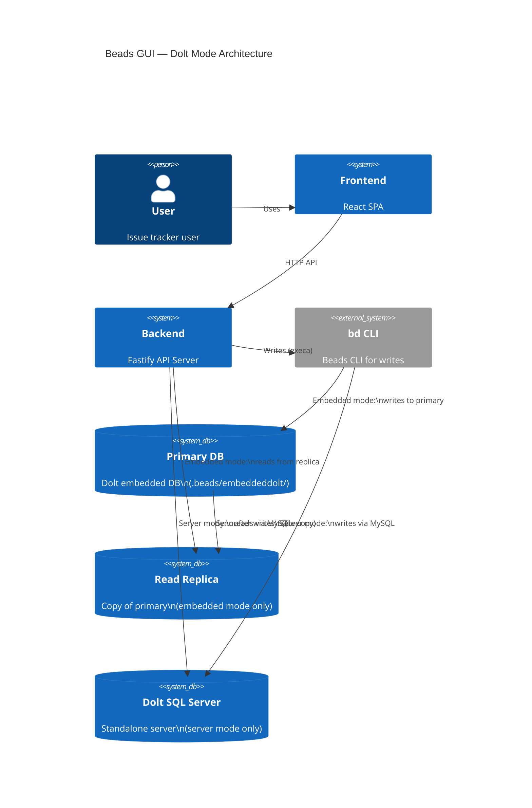
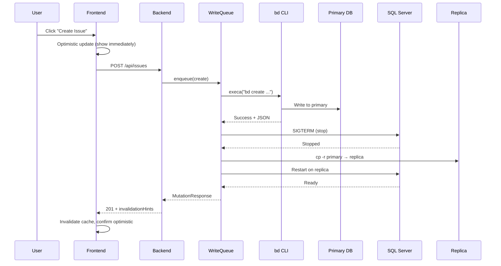
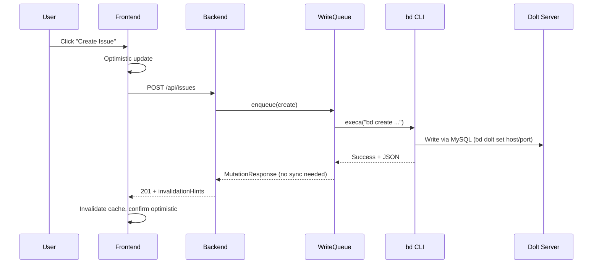
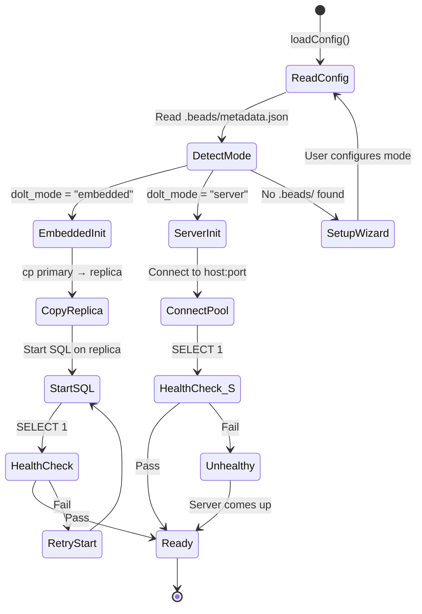

# Dolt Mode Abstraction — System Specification

## Problem Statement

The beads-gui backend has a critical production bug: all write operations fail because the backend's Dolt SQL server and the `bd` CLI both compete for an exclusive embedded lock on the same database directory. This makes the app read-only in practice.

## Solution

Abstract the Dolt backend into two modes — **embedded** (with a read replica to avoid lock conflicts) and **server** (connecting to a standalone Dolt SQL server). The backend auto-detects the mode from `.beads/metadata.json` and configures itself accordingly.

## Architecture

### Embedded Mode (default, single-user)
```
WRITE: API → WriteQueue → bd CLI → PRIMARY DB (exclusive, uncontested)
                              ↓ (post-write sync)
                         stop SQL server → cp primary → replica → restart

READ:  API → MySQL pool → Dolt SQL Server → REPLICA DB (separate copy)
```

### Server Mode (multi-user, remote-capable)
```
WRITE: API → WriteQueue → bd CLI → Dolt SQL Server (via bd dolt set host/port)

READ:  API → MySQL pool → same Dolt SQL Server
```

## EARS Requirements

### Ubiquitous
- REQ-U1: The backend SHALL use `bd` CLI for all write operations (create, update, close, dependency, comment).
- REQ-U2: The backend SHALL use MySQL2 connection pool for all read operations.
- REQ-U3: The backend SHALL read `dolt_mode` from `.beads/metadata.json` to determine operating mode.

### Event-Driven
- REQ-E1: WHEN the backend starts in embedded mode, IT SHALL copy the primary DB to a replica directory and start the Dolt SQL server on the replica.
- REQ-E2: WHEN a write operation completes in embedded mode, IT SHALL sync the replica by stopping the SQL server, re-copying the primary, and restarting.
- REQ-E3: WHEN the backend starts in server mode, IT SHALL connect the MySQL pool to the configured host:port without starting any Dolt subprocess.
- REQ-E4: WHEN no `.beads/` directory exists, IT SHALL display a setup wizard offering embedded (default) or server mode configuration.

### State-Driven
- REQ-S1: WHILE the sync is in progress in embedded mode, the frontend SHALL rely on optimistic UI updates; React Query poll suppression prevents stale reads.
- REQ-S2: WHILE in server mode, the backend SHALL NOT manage any Dolt server lifecycle (no start, stop, restart, health-check-driven restarts).

### Unwanted
- REQ-UW1: The backend SHALL NOT allow bd CLI and the SQL server to access the same database directory simultaneously in embedded mode.
- REQ-UW2: The backend SHALL NOT expose the sync window to the user; optimistic updates mask the brief read unavailability.
- REQ-UW3: The backend SHALL NOT require external dependencies for embedded mode (zero-config out of the box).

### Optional
- REQ-O1: The backend MAY support a GUI setup wizard for first-run mode selection when no `.beads/` exists.
- REQ-O2: The backend MAY support hot-switching between modes without restart (future).

## Scenario Table

| # | Scenario | Trigger | Expected Behavior | Mode |
|---|----------|---------|-------------------|------|
| 1 | Backend starts, embedded mode | App launch | Copy primary → replica, start SQL on replica, pool connects to replica | Embedded |
| 2 | Backend starts, server mode | App launch | Pool connects to configured host:port, no subprocess | Server |
| 3 | Create issue via UI | POST /api/issues | bd CLI writes to primary, sync replica, optimistic UI shows immediately | Embedded |
| 4 | Create issue via UI | POST /api/issues | bd CLI writes via server, SQL server sees it immediately | Server |
| 5 | Read issues after write | GET /api/issues | Reads from synced replica (embedded) or same server (server) | Both |
| 6 | Sync during read | Concurrent GET during sync | React Query retries silently, optimistic cache used | Embedded |
| 7 | No .beads/ exists | First launch | Show setup wizard, user picks mode, initialize | Both |
| 8 | Server unreachable | GET /api/health | Health endpoint returns unhealthy, HealthBanner shows | Server |
| 9 | Rapid writes | 5 creates in sequence | WriteQueue serializes, sync runs once per write | Embedded |

## C4 Context Diagram



## Sequence Diagrams

### Embedded Mode — Write + Sync



### Server Mode — Write (no sync needed)



## State Diagram — Backend Startup



## Design Notes

- **Build-great-things applicable**: This is infrastructure work, not UI — the `/compound:build-great-things` skill is NOT needed for these epics.
- **Delivery profile**: `service` — backend infrastructure with E2E test validation.
- **bd CLI is non-negotiable**: All writes MUST go through bd CLI. No direct SQL writes.
- **Optimistic UI already exists**: The frontend already has optimistic updates, poll suppression during mutations, and React Query retry. The sync window is invisible to users.
