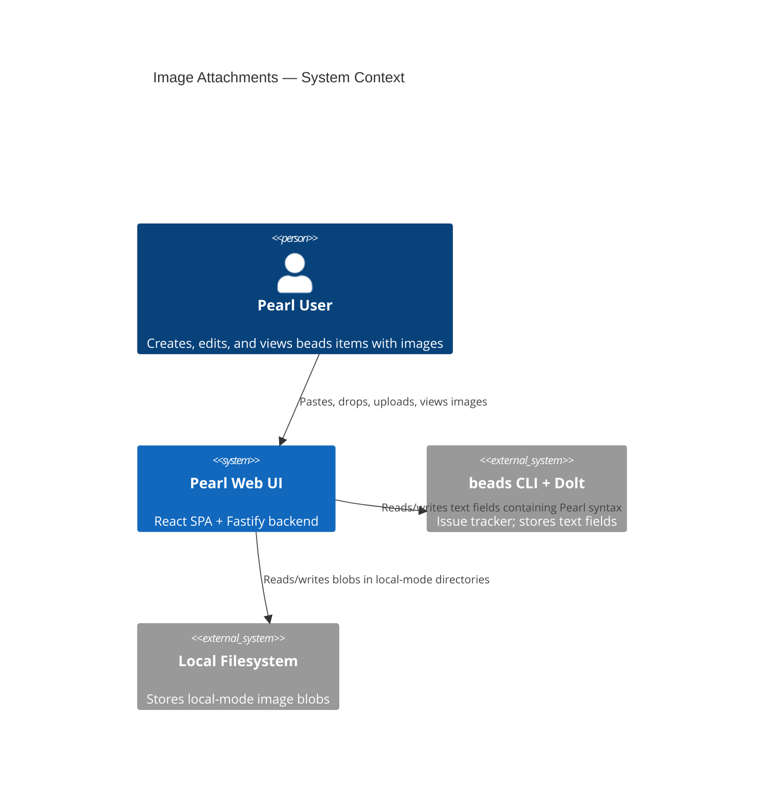
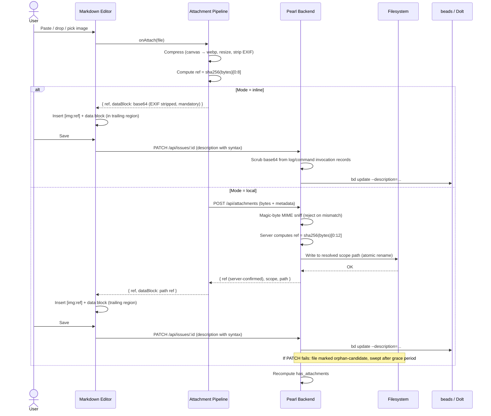
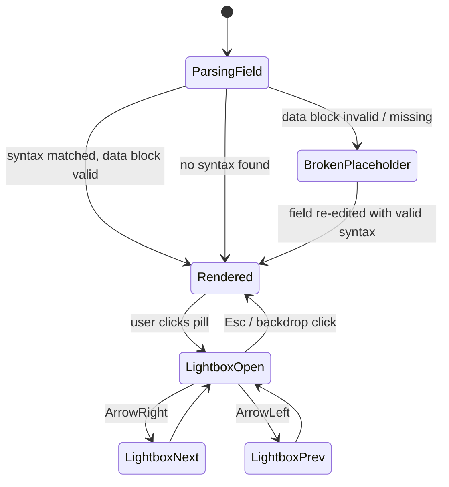
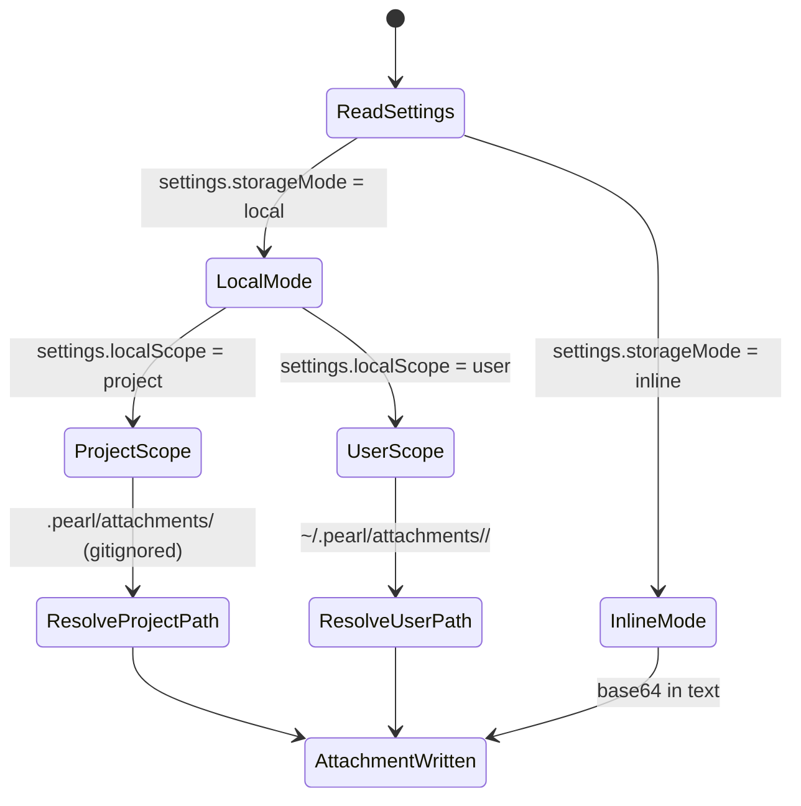

# Image Attachments — System Specification

**Version**: 1.1 (post-advisory, pre-Gate-2)
**Date**: 2026-04-19
**Status**: Draft — advisory fleet consulted; awaiting Gate 2 approval
**Delivery Profile**: `webapp` (advisory — each epic defines its own verification contract)
**Companion doc**: `image-attachments-advisory-brief.md` (advisor findings synthesis)

## 1. Overview

Enable Pearl users to attach images to beads items (description, design, acceptance criteria, notes, and comments) using a clipboard paste, drag-and-drop, or file picker. Since the `beads` CLI has no native attachment support, images are embedded into existing markdown text fields via a **Pearl-specific custom syntax** that stays readable in `bd show`, survives round-tripping through the `bd` CLI, and renders as inline pill tokens in the Pearl UI with a lightbox carousel for viewing.

Users can toggle between two storage modes:

1. **Inline base64** — bytes encoded directly into the text field. Syncs via `bd dolt push`. Works everywhere beads works.
2. **Local filesystem** — bytes written to a configurable directory; the text field stores only a stable path reference. Does not sync via Dolt.

### Design Note

This feature is user-facing and design-critical. Applicable epics should invoke `/compound:build-great-things` during their work phase for:

- Paste/drop/picker interaction design
- Pill token typography and affordance
- Lightbox motion, keyboard nav, carousel transitions
- Settings UI (size limits, mode toggle, path overrides)
- Empty, loading, error, and oversize states
- Accessibility (alt text, keyboard-only operation, reduced-motion respect)

### Pearl-syntax (locked for Phase 2)

Every attachment has two parts in the host field: an **inline pill reference** and a **data block** (HTML comment). Both live in the same markdown field.

**Inline pill reference** (user-visible in `bd show`):
```
[img:<ref>]
```
- `<ref>` is a content-derived ID: first **12 hex chars** of SHA-256 (48 bits, pushes birthday collisions past realistic team scale)
- Appears anywhere in the flow of prose
- `bd show` prints this as literal text; Pearl renders it as a pill token

**Data block placement rule** (v1.1, post-advisory): all data blocks for a given host field are grouped at the **end of the field**, separated from prose by a blank line. This footnote-style placement simplifies the parser, enables deterministic round-trips through `bd edit`, and lets `bd show` users skip past the trailing region easily.

**Data block** (one per unique `<ref>`, in the trailing region of the same field):

Inline-base64 form:
```
<!-- pearl-attachment:v1:<ref>
type: inline
mime: image/webp
data: UklGRh4AAABXRUJQVlA4...
-->
```

Local-filesystem form:
```
<!-- pearl-attachment:v1:<ref>
type: local
mime: image/webp
scope: project | user
path: attachments/2026/04/a1b2c3d4.webp
sha256: <full-hash>
-->
```

**Why HTML comments**: react-markdown ignores them, pagers skip them, the `bd` CLI prints them harmlessly, and a strict regex extracts them for indexing. The `v1` version tag enables future format migration without breaking parsers.

## 2. Domain Glossary

| Term | Definition |
|------|-----------|
| **Attachment** | An image embedded in a beads text field via Pearl syntax |
| **Ref** | Short content-derived ID (8-char SHA-256 prefix) that uniquely identifies an attachment's bytes |
| **Host field** | A markdown-capable field (description, design, acceptance_criteria, notes) or a Comment that contains attachment syntax |
| **Pill** | The rendered UI token `🖼️ 1` in place of `[img:<ref>]` |
| **Data block** | The HTML comment carrying either base64 data or a local-path reference for one `<ref>` |
| **Attachments section** | A per-issue gallery (on the detail page) aggregating every attachment across all host fields |
| **Lightbox** | Modal image viewer opened by clicking a pill or gallery tile |
| **Carousel** | Left/right navigation across all attachments on an issue inside the lightbox |
| **Storage mode** | `inline` (base64) or `local` (filesystem) — chosen per workspace |
| **Scope** | `project` (`.pearl/attachments/` at repo root) or `user` (`~/.pearl/attachments/<project>/`) — local-mode only |
| **Encoding policy** | Configurable max dimensions, target format (webp), max byte size, EXIF stripping |
| **has_attachments flag** | Boolean on `IssueListItem` driving the list/board indicator |

## 3. EARS Requirements

### 3.1 Ubiquitous

| ID | Requirement |
|----|------------|
| U1 | The system SHALL render `[img:<ref>]` tokens as clickable pill components in every markdown field and comment |
| U2 | The system SHALL render the attachment gallery section on the detail view showing all attachments across all host fields |
| U3 | The system SHALL display an image-present indicator on list and board rows for issues whose `has_attachments` flag is true |
| U4 | The system SHALL parse the Pearl attachment syntax such that malformed or unknown-version data blocks degrade to plain text without breaking markdown rendering |
| U5 | The system SHALL round-trip attachment syntax through `bd` CLI edits without data loss (strict regex preserves bytes) |
| U6 | The system SHALL persist all Pearl settings (storage mode, size limits, path overrides) in `.pearl/settings.json` at the project root |
| U7 | The system SHALL support both inline and local storage modes simultaneously within the same issue (transparent coexistence) |
| U8 | The system SHALL enforce per-user accessibility: keyboard-only operation, focus management, alt text prompts |
| U9 | The system SHALL strip EXIF metadata from every uploaded image before encoding (mandatory invariant for inline mode; not user-configurable) |
| U10 | The system SHALL place all attachment data blocks at the end of their host field, separated from prose by a blank line, to guarantee deterministic parser behavior and round-trip safety |
| U11 | The system SHALL lazy-load attachment data blocks on the detail view (render the pill immediately; fetch/decode bytes only when the lightbox opens or the gallery tile enters the viewport) |
| U12 | The system SHALL perform markdown-field attachment parsing in a Web Worker when the field size exceeds 256KB, to avoid blocking the UI thread |

### 3.2 Event-Driven

| ID | Requirement |
|----|------------|
| E1 | WHEN the user pastes, drops, or selects an image in a markdown editor, the system SHALL compress it per the encoding policy, compute its `<ref>`, and insert both the inline pill and the data block |
| E2 | WHEN the user clicks a pill, the system SHALL open the lightbox scoped to the pill's `<ref>` with carousel navigation across the issue's other attachments |
| E3 | WHEN the user saves a host field containing attachment syntax (inline mode), the system SHALL write the unchanged text to beads via the existing update path |
| E3a | WHEN the user adds a local-mode attachment, the system SHALL upload bytes first, receive a server-confirmed `ref` (server computes the hash from received bytes), and only then insert the pill + data block into the host field — ensuring no pill is inserted without a durably persisted backing file |
| E3b | WHEN a local-mode upload completes but the subsequent issue update fails, the server SHALL mark the uploaded file as orphan-candidate and a periodic sweep SHALL delete uncommitted files older than a grace period (default 1 hour) |
| E4 | WHEN the backend writes a host field, the system SHALL recompute `has_attachments` for the issue based on syntax detection across all host fields |
| E4a | WHEN a detail view is requested, the system SHALL scan the issue's host fields on read and reconcile `has_attachments` if it desynced from actual content (recovers from external `bd` CLI edits) |
| E5 | WHEN the user changes storage mode in settings, the system SHALL apply the new mode to subsequent uploads without modifying existing attachments |
| E6 | WHEN the user changes size/encoding limits in settings, the system SHALL apply them to subsequent uploads only |
| E7 | WHEN an image fails the size policy after compression, the system SHALL reject the upload with a specific error message naming the limit exceeded |
| E8 | WHEN a local-mode reference points to a missing file, the system SHALL render a broken-attachment placeholder with the `<ref>` visible |

### 3.3 State-Driven

| ID | Requirement |
|----|------------|
| S1 | WHILE the user is editing a markdown field, the system SHALL accept drag-enter events and show a drop zone overlay |
| S2 | WHILE the lightbox is open, the system SHALL intercept arrow keys for carousel nav and `Esc` for close |
| S3 | WHILE the backend is writing a local-mode file, the system SHALL show an upload-in-progress indicator on the relevant field |

### 3.4 Unwanted Behavior

| ID | Requirement |
|----|------------|
| X1 | IF a pasted image exceeds the configured max dimensions or byte size after compression, THEN the system SHALL reject the upload with a specific error — it SHALL NOT silently truncate or degrade quality beyond the policy |
| X2 | IF a local-mode path traversal is detected (e.g., `../` escaping the configured directory), THEN the system SHALL reject the upload |
| X3 | IF two attachments produce the same `<ref>` (content hash collision or truncation clash), THEN the system SHALL append a disambiguator rather than overwrite |
| X4 | IF `.pearl/settings.json` is missing or malformed, THEN the system SHALL fall back to documented defaults and log a warning — NOT crash |
| X5 | IF the user edits the data block by hand in a way that invalidates the syntax, THEN the affected pill SHALL render a broken-attachment placeholder — NOT corrupt the whole field |
| X6 | IF an uploaded file fails server-side magic-byte MIME validation (client-declared MIME is ignored), THEN the system SHALL reject the upload — never trust client-reported content type |
| X7 | IF an attachment data block appears in a command invocation or log record, THEN the logging middleware SHALL redact the `data:` payload to a summary marker (e.g., `<redacted 48KB webp>`) to avoid leaking base64 content into Pino logs or audit trails |
| X8 | IF the team commits `.pearl/settings.json` with `storageMode: local`, THEN the settings UI SHALL display a prominent warning that attachments will NOT sync across machines — to prevent silent collaboration breakdown |

### 3.5 Optional Features

| ID | Requirement |
|----|------------|
| O1 | The system MAY de-duplicate inline-base64 bytes within a single field (multiple refs pointing to same data block) |
| O2 | The system MAY offer a one-shot bulk convert between storage modes as a separate action |
| O3 | The system MAY support non-image attachment types (e.g., small PDFs) — out of scope for v1 |
| O4 | The system MAY expose attachment metadata (uploaded-by, uploaded-at) in the data block |

## 4. Architecture

### 4.1 C4 Context



### 4.2 Attachment Upload Sequence



### 4.3 Rendering State Machine



### 4.4 Storage Mode Decision Tree



## 5. Settings Schema (`.pearl/settings.json`)

```jsonc
{
  "version": 1,
  "attachments": {
    "storageMode": "inline" | "local",
    "local": {
      "scope": "project" | "user",
      "projectPathOverride": null | "custom/path",
      "userPathOverride": null | "/abs/path"
    },
    "encoding": {
      "format": "webp",
      "maxBytes": 1048576,
      "maxDimension": 2048,
      "stripExif": true
    }
  }
}
```

Defaults apply when keys are absent. `.pearl/settings.json` is intended to be **committed to git** as team policy; individual overrides can be supported later via `.pearl/settings.local.json` if needed.

## 6. Scenario Table

| # | Trigger | Mode | Expected Outcome |
|---|---------|------|------------------|
| 1 | Paste 800KB PNG into description, mode=inline | inline | Compressed to webp, `[img:a1b2c3d4]` + data block inserted, saves into Dolt |
| 2 | Paste 3MB HEIC into description, mode=local, scope=project | local/project | Transcoded to webp, written to `.pearl/attachments/...`, path reference inserted |
| 3 | Drop 10 images in sequence into notes | current | Each processed independently; pills numbered [img:...] with unique refs |
| 4 | Click pill in rendered markdown | either | Lightbox opens; arrow keys navigate across all issue attachments |
| 5 | Open issue whose description has 3 inline + 2 local attachments | mixed | Gallery shows all 5; both types render correctly |
| 6 | User changes mode from inline → local in settings | — | Existing attachments unchanged; next upload uses local |
| 7 | User edits description via `bd edit` and reshuffles text | either | Syntax preserved; Pearl re-renders correctly on next load |
| 8 | User edits description via `bd edit` and mangles a data block | either | That one pill shows broken placeholder; other attachments unaffected; field still loads |
| 9 | User pastes 20MB raw PNG | either | Compression brings under limit OR rejected with specific error |
| 10 | Local file deleted from `.pearl/attachments/` externally | local | Broken placeholder with the `<ref>` displayed on next render |
| 11 | List view loads 500 issues | either | Only `has_attachments` bool fetched; image data not streamed to list endpoint |
| 12 | Comment gets an image | either | Comment renders pill; gallery includes comment attachments |
| 13 | `bd show` in terminal on attachment-rich issue | either | Pills visible as `[img:...]`; data blocks printed as HTML comments (unobtrusive) |
| 14 | Missing `.pearl/settings.json` | — | Defaults used; warning logged; no crash |

## 7. Known Assumptions & Fitness Functions

| Assumption | Fitness function | Re-decomposition trigger |
|---|---|---|
| Users will stay within configured size limits after compression | Measure upload reject rate in POC | >10% reject rate → revise defaults or storage model |
| Dolt history growth per inline image ≤ ~2× compressed blob over a year of edits | Measure `.dolt/` growth with 20 edits × 10 images in POC | Growth >5× → make local-mode the default or introduce deduplication |
| Pearl syntax survives `bd edit` round-trips | Integration test: write syntax, invoke `bd edit`, read back | Any corruption in happy path → block feature launch |
| Clipboard / drag APIs produce decodable formats on macOS/iOS Safari | Manual matrix test in POC | HEIC or unknown MIME → add transcode step |
| Two users editing same field don't produce ref collisions | SHA-256 collision probability analysis | Collision observed → increase ref length / add disambiguator |

## 8. Out of Scope (v1)

- Video, PDF, or arbitrary file attachments
- Editing images after upload (crop, rotate, annotate)
- Cloud/CDN storage backends
- Bulk migration between storage modes (may be added in v2 per O2)
- Attachment access control / permissions
- Thumbnail caching (rely on browser image cache for v1)
- A dedicated Dolt blob table (considered, rejected for v1 — the two-mode toggle covers the envelope)

## 9. Processing Order Hint

Epics must be processed in this order (exact list materialized in Phase 4):

1. **POC & Measurement** — validates both storage modes; **go/no-go gate** requires: (a) Dolt history growth ≤ threshold, (b) browser memory at 10×1MB attachments acceptable, (c) `bd edit` round-trip preserves syntax byte-for-byte. POC failure blocks downstream epics.
2. **Settings infrastructure** — `.pearl/settings.json` schema, load/save, API, settings-view section.
3. **Core attachment protocol** — shared parser/serializer/types (trailing-region placement, 12-char ref, version tagged), used by both adapters + renderer.
4. **Inline storage adapter** — client-side canvas compression pipeline, EXIF stripping (mandatory), paste/drop/picker → serialized syntax.
5. **Local storage adapter** — backend `POST /api/attachments` (server-computes ref, magic-byte sniff, atomic write, orphan sweep), backend `GET /api/attachments/:ref` (scoped, path-traversal-safe), settings-driven scope resolution.
6. **6a Attachment Inputs** (post-advisory split) — paste/drop/picker wiring into `MarkdownSection` and `CommentThread`; adapter selection from settings.
7. **6b Attachment Outputs** (post-advisory split) — pill rendering via remark plugin, attachments gallery section, lightbox + carousel, broken-attachment placeholder.
8. **List/board indicator** — `has_attachments` in `IssueListItem` projection (write-time compute + read-time reconciliation), icon in list/board rows.
9. **Integration Verification** — cross-epic contracts (see Phase 4 IV epic).

Comments-attachment support is absorbed into epic 6a/6b since it reuses the same pipeline.
