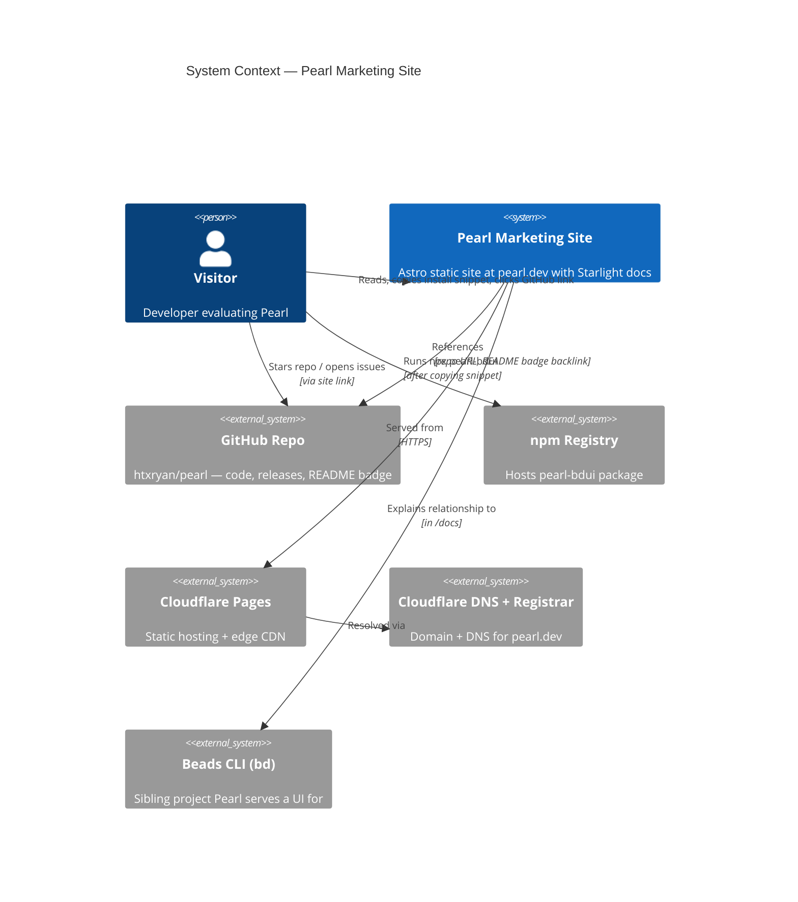
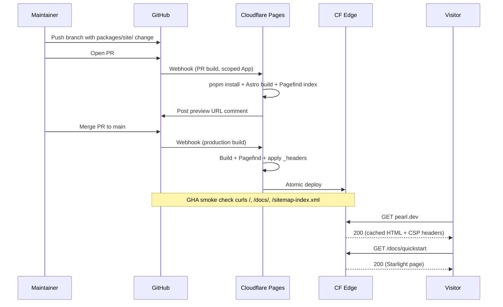
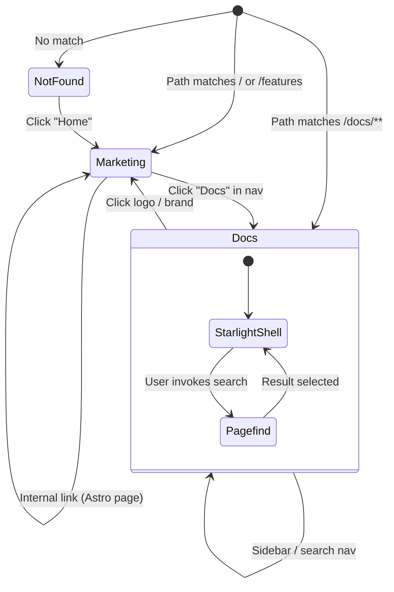

# Pearl Marketing Site — System Specification

> Revised after advisory fleet at Gate 2. See `marketing-site-advisory-brief.md` for the full advisory record. Changes vs. the draft are summarized in §15.

## 1. Purpose

A public-facing static website at a custom domain that introduces **Pearl** (the web UI for the Beads issue tracker) to visitors and drives three conversion goals (in priority order):

1. **Run** — visitor copies and runs `npx pearl-bdui` in their terminal.
2. **Star** — visitor stars `htxryan/pearl` on GitHub.
3. **Read** — visitor navigates to `/docs/*` to learn the product.

The site combines a hand-styled **marketing landing page** (Astro) with a **technical documentation section** at `/docs` (Astro **Starlight** integration). Both ship from a single Astro project in `packages/site/` and deploy as a single static bundle to **Cloudflare Pages**, served from a domain registered through **Cloudflare Registrar**.

## 2. Non-Goals

- App-like interactivity (auth, dynamic dashboards) — out of scope; static-first.
- A full visual identity refresh — the site reuses the existing Pearl app palette and adds only a wordmark + favicon.
- Auto-syncing docs from the main repo at build time — docs live in the site package as MDX.
- Multi-language support — English-only at launch.
- A blog or changelog section — deliberately deferred; release notes stay on GitHub.
- Analytics that require cookies or consent flows — privacy-friendly only (see §6). Marketing-funnel analytics are out of scope at v1; star-count badge is the only tracked signal.
- Visual regression testing infrastructure (Playwright VRT, Argos, Percy) — out of scope at v1; replaced by a manual smoke checklist.

## 3. Stakeholders & Audience

- **Primary audience**: OSS-friendly developers using AI coding workflows who already know about Beads or are searching for an issue tracker that lives in their repo.
- **Secondary audience**: developers landing from the GitHub repo's "Website" link.
- **Owner**: htxryan (single maintainer); operates with a low-maintenance budget.

## 4. EARS Requirements

### 4.1 Ubiquitous (always-on)

- **U1**: The site shall be served as a single static bundle from Cloudflare Pages over HTTPS.
- **U2**: The site shall use the apex domain (e.g., `pearl.dev`) for production and a Cloudflare Pages preview URL per pull request.
- **U3**: The marketing routes (`/`, `/features`, etc.) shall be authored as Astro pages in `packages/site/src/pages/`.
- **U4**: All `/docs/*` routes shall be owned by the Astro Starlight integration mounted at the `docs` path prefix; theming **shall** be implemented via CSS custom properties only — `.astro` component overrides are prohibited at v1 to limit Starlight upgrade tax.
- **U5**: The site shall load core typography (Inter for UI, JetBrains Mono for code) self-hosted via `@fontsource*` packages — no third-party font CDN. Variable font files shall be used; non-essential weights shall not be loaded.
- **U6**: The site shall meet a Lighthouse score budget on cold mobile load (Moto G4 throttling): **Performance ≥ 85**, **Accessibility ≥ 95**, **Best Practices ≥ 95**, **SEO ≥ 95**.
- **U7**: The site shall expose `/sitemap-index.xml`, `/robots.txt`, and Open Graph + Twitter card metadata. **OG images** shall be static (committed to the repo) for v1; one OG image is required for `/` and `/docs/`; per-section docs OG images are optional; remaining pages inherit the site-level default.
- **U8**: The site shall link to the GitHub repository (`github.com/htxryan/pearl`) from the global header and footer.
- **U9**: The repository's `README.md` shall display a website badge linking to the production URL, and the GitHub repo's "Website" field shall be set to the production URL.
- **U10**: The site shall present an install snippet (`npx pearl-bdui`) above the fold on the landing page with a one-click copy affordance.
- **U11** *(security headers)*: The site shall ship a Cloudflare Pages `_headers` file applying:
  - **Content-Security-Policy**: `default-src 'self'; script-src 'self'; style-src 'self' 'unsafe-inline'; img-src 'self' data:; font-src 'self'; connect-src 'self'; frame-ancestors 'none'; base-uri 'self'`
  - **Strict-Transport-Security**: `max-age=63072000; includeSubDomains; preload`
  - **Referrer-Policy**: `strict-origin-when-cross-origin`
  - **X-Content-Type-Options**: `nosniff`
  - **Permissions-Policy**: restrictive defaults (camera, microphone, geolocation, payment denied)
  CI shall verify these headers are present on production and preview deploys.
- **U12** *(build provenance)*: Cloudflare Pages shall be installed as a **GitHub App** scoped to `htxryan/pearl` only (not OAuth, not org-wide). The Cloudflare Pages build environment **shall not** contain any secrets at v1. PR builds from outside contributors shall require maintainer approval before deploying a preview.
- **U13** *(dependency hygiene)*: The pnpm `pnpm-lock.yaml` shall be committed; `astro` and `@astrojs/starlight` shall be exact-pinned (no `^`); a documented monthly Renovate (or manual) sweep cadence shall apply to all site dependencies.
- **U14** *(workspace isolation)*: `packages/site/` shall be a pnpm workspace package but **shall be excluded** from default `pnpm test`, `pnpm build`, `pnpm typecheck`, and `pnpm lint:deps` runs via filtered scripts so app changes don't trigger site CI and vice versa.

### 4.2 Event-driven (When …)

- **E1**: **When** a pull request is opened or updated against `main` that modifies `packages/site/**`, the CI workflow **shall** trigger a Cloudflare Pages preview deployment and post the preview URL as a PR comment. PRs from outside contributors require maintainer approval before deploy (see U12).
- **E2**: **When** a commit lands on `main` that modifies `packages/site/**`, Cloudflare Pages **shall** build and publish a new production deployment within 5 minutes.
- **E3**: **When** a visitor clicks the install snippet's copy button, the site **shall** copy the literal string `npx pearl-bdui` to the clipboard and display a transient confirmation.
- **E4**: **When** a visitor lands on a Starlight page, the page **shall** render with the Pearl-themed CSS custom properties (palette tokens, type scale) overriding Starlight defaults.
- **E5**: **When** a production deploy completes, a CI smoke check **shall** curl `/`, `/docs/`, and `/sitemap-index.xml` and assert HTTP 200 + non-zero body. On failure, the alert routes to the maintainer (no automatic rollback at v1).

### 4.3 State-driven (While …)

- **S1**: **While** the visitor's OS preference is dark mode, the site **shall** render in its dark theme on first paint with no flash of incorrect theme (FOIT/FOTC).
- **S2**: **While** Pagefind index is being built (Starlight's bundled search), the build **shall** include all `/docs/*` content; runtime search **shall** be client-side only with no server dependency. CI **shall** assert that the `.pagefind` directory exists and contains at least 1 indexed page after every build.

### 4.4 Unwanted-behavior (If … then …)

- **UB1**: **If** the Cloudflare Pages build fails, **then** Cloudflare Pages **shall** retain the previous successful deployment as the live alias. *(Note: this is the build-success-only guarantee CF Pages provides natively; deeper post-deploy health logic is handled by E5's smoke check.)*
- **UB2a** *(internal links: blocking)*: **If** an internal `<a>` link points to a path that does not exist at build time, **then** the build **shall** fail (link checker enforced as an Astro integration in CI per PR).
- **UB2b** *(external links: scheduled, non-blocking)*: External link checking **shall** run as a weekly scheduled GitHub Action that opens an issue listing broken links. It **shall not** block PR merges.
- **UB3**: **If** the visitor has set `prefers-reduced-motion`, **then** the site **shall** disable all non-essential animations.
- **UB4**: **If** the visitor is on an unsupported browser (no ES2020 support), **then** the marketing page **shall** still render legibly via progressive enhancement (no critical JS-only content).

### 4.5 Optional (Where …)

- **O2**: **Where** the visitor opts into the docs search affordance, Starlight **shall** surface its built-in Pagefind UI.

*(O1 — Cloudflare Web Analytics — was dropped at Gate 2; KPIs are not measurable from CF Web Analytics in an actionable way at v1.)*

## 5. Architecture

### 5.1 C4 Context

### 5.2 Deploy & Publish Sequence

### 5.3 Routing State

## 6. Scenario Table

| # | Scenario | EARS | Actor | Trigger | Expected Outcome |
|---|---|---|---|---|---|
| 1 | First visit on mobile | U1, U6, S1 | Visitor | Cold load `pearl.dev` on phone | HTML painted < 1.5s, dark theme if OS prefers, Lighthouse Perf ≥ 85, others ≥ 95 |
| 2 | Copy install command | U10, E3 | Visitor | Click copy on hero | Clipboard contains `npx pearl-bdui`; toast confirms |
| 3 | Read docs | U4, S2 | Visitor | Click "Docs" → "Quickstart" | Starlight shell renders with Pearl theming; search works offline |
| 4 | Star on GitHub | U8 | Visitor | Click GitHub icon in header | Navigates to `github.com/htxryan/pearl` in new tab |
| 5 | Maintainer opens PR | E1, U12 | Maintainer | Push branch + open PR | CF Pages preview URL posted as comment; outside-contributor PRs require approval |
| 6 | Maintainer ships content | E2, E5 | Maintainer | Merge to `main` | Production deploys within 5 min; smoke check passes |
| 7 | Build catches dead internal link | UB2a | Maintainer | Push PR with broken `/docs/foo` link | CI fails; PR cannot merge |
| 8 | Weekly external link sweep | UB2b | System | Scheduled GHA | Issue opened listing broken external links; no PR blocked |
| 9 | Reduced motion user | UB3 | Visitor | Visits with `prefers-reduced-motion` | All non-essential animations off |
| 10 | Old browser fallback | UB4 | Visitor | IE-class browser | Marketing legible without JS-driven content |
| 11 | Bad deploy retained | UB1 | System | Build fails | Previous deploy kept live |
| 12 | CSP enforced | U11 | Visitor | Visits any page | Response includes CSP, HSTS, Referrer-Policy, X-CTO, Permissions-Policy headers |
| 13 | Pagefind index integrity | S2 | CI | Post-build assertion | `.pagefind` exists and contains ≥ 1 page; build fails if empty |
| 14 | Smoke check on prod deploy | E5 | CI | Post-deploy GHA step | curl `/`, `/docs/`, `/sitemap-index.xml` → 200 + non-zero body |

## 7. Constraints

- **Budget**: Total annual cost target < $25 — domain registration only (Cloudflare Pages free tier covers hosting; no analytics, no VRT).
- **Maintenance**: Single maintainer; site must require near-zero ongoing work after launch.
- **Repo discipline**: `packages/site/` follows the monorepo's Biome + TypeScript + pnpm conventions but is excluded from default pnpm matrix runs (U14).
- **Privacy**: No third-party tracking, no cookies, no consent banners required.
- **Security**: CSP + HSTS + scoped GitHub App + no build-env secrets (U11/U12).
- **Compatibility**: Works on the last 2 major versions of Chrome, Firefox, Safari, Edge.
- **Search engines**: Indexable, sitemap published, canonical URLs set.

## 8. Assumptions

- A `.dev` domain matching the brand is available at Cloudflare Registrar wholesale pricing (≤ $15/yr). **This is a P0 blocker** — verified before any other epic begins.
- The current Pearl frontend palette is portable — its CSS custom properties can be lifted into the marketing site without coupling the build to `packages/frontend`.
- Cloudflare Pages' GitHub App integration is sufficient for build + deploy; GitHub Actions is used only for: link-checking (UB2a/b), Lighthouse budgets (U6), security-headers verification (U11), Pagefind integrity (S2), post-deploy smoke (E5).
- Starlight's CSS-custom-property theming surface is sufficient to make /docs visually consistent with marketing pages — no `.astro` component overrides at v1 (U4).
- Maintainer (htxryan) is willing to register the chosen domain on a personal Cloudflare account and grant the Cloudflare Pages GitHub App access scoped to `htxryan/pearl` only.

## 9. Delivery Profile

**Profile**: `webapp` (static-rendered).

This is **advisory only** — downstream epics still produce their own `## Verification Contract`. The profile informs verification expectations:

- **Lighthouse budgets** (Perf ≥ 85, others ≥ 95) on cold mobile.
- **Link checking**: internal blocking per PR; external scheduled weekly.
- **Security headers verification** in CI.
- **Pagefind index integrity** assertion in CI.
- **Post-deploy smoke check** via GHA (curl + status).
- **Manual smoke checklist** before promoting prod alias (replaces VRT).
- **No server-side test infrastructure** — entirely static.

## 10. Design Skill Note

This system is **design-relevant**: the marketing landing page must compete on first-impression craft (typography, hierarchy, motion, visual rhythm) and the docs must look intentional, not template-default. **Epic 2 (Site shell, brand, marketing landing & docs)** **shall invoke `/compound:build-great-things`** during its work phase.

The skill covers both software-design philosophy (Ousterhout's deep modules, complexity management, information architecture) and the visual build sequence for user-facing products (IA, typography, color, motion, states, accessibility, conversion). See `.claude/skills/compound/build-great-things/SKILL.md` for the playbook.

## 11. Risks & Mitigations

| Risk | Mitigation |
|---|---|
| Preferred domain unavailable / over-budget | Domain epic ships ranked shortlist + 1 fallback; all other epics gated on registration |
| Starlight theming friction at v1 | CSS-custom-properties-only constraint (U4); component overrides prohibited |
| Cloudflare Pages build limits hit | Build-skip rule for non-`packages/site/**` changes; site is excluded from default pnpm matrix (U14) |
| Single-maintainer bus factor on content | All content is Markdown/MDX in repo; no CMS; Quickstart-only is a valid v1 launch |
| Vendor lock-in (Cloudflare) | Static output is portable to any host; DNS and hosting can be split |
| Build-pipeline supply-chain | Lockfile committed (U13), Astro+Starlight exact-pinned, no secrets in build env (U12) |
| Preview-deploy phishing surface | Outside-contributor PR builds require approval (U12); no production alias for previews |

## 12. Open Questions (resolve in epic phase)

- Final domain shortlist + winner.
- Wordmark concept (Pearl glyph? type-only?) — proposed in Epic 2.
- Whether `/features` deserves a dedicated page or stays as sections on `/`.

## 13. Decomposition Preview

Decomposition into epics is performed in Phase 3. Anticipated 4-epic structure:

1. **Domain & DNS** *(critical path; runs first)* — register chosen `.dev` domain via Cloudflare Registrar; configure DNS records; reserve apex + `www` redirect; document the OAuth/App scope decision (U12).
2. **Site shell, brand, marketing landing & content (incl. /docs Starlight)** *(the bulk of the work)* — Astro project skeleton, palette tokens, wordmark + favicon, marketing landing with hero/features/install snippet, OG metadata, Starlight integration mounted at /docs, theme overrides via CSS custom props, content collection, sidebar IA, port README + write 3-5 guides (Quickstart, Install/Modes, Configuration, Themes, FAQ, Troubleshooting).
3. **Build & deploy pipeline** — Cloudflare Pages connection (GitHub App, U12), preview deploys, link checking (UB2a/b), Lighthouse budgets (U6), `_headers` security verification (U11), Pagefind integrity check (S2), pnpm workspace isolation (U14), exact-pin policy (U13).
4. **Launch & integration verification** — README badge, GitHub repo "Website" field, sitemap submission, social preview validation, end-to-end smoke checklist, production smoke check (E5), and validation of all cross-epic interface contracts (palette tokens, routing, deploy pipeline, repo links). *(Replaces a standalone Integration Verification epic.)*

Final structure decided after the Phase 3 6-angle convoy and Gate 3 approval.

## 14. Interface Contract Summary (preview)

Cross-epic contracts that Phase 3 must explicitly capture:

| Source | Target | Contract | Type |
|---|---|---|---|
| Epic 1 | Epic 3 | Domain `pearl.dev` (or chosen) registered, NS pointing to Cloudflare | Data |
| Epic 1 | Epic 4 | Production URL string for README badge + GitHub Website field | Data |
| Epic 2 | Epic 3 | `pnpm --filter @pearl/site build` produces a `dist/` with `_headers` + `.pagefind` | Behavioral |
| Epic 2 | Epic 4 | Final landing page + docs ready for smoke checklist | Data |
| Epic 3 | Epic 4 | CF Pages domain attached; preview URL pattern documented | Behavioral |
| Epic 2 | Epic 2 (internal) | Palette tokens file is the single source of truth for marketing + Starlight | Data |

## 15. Change Log

- **2026-04-29 draft**: Initial spec from Phase 2 Socratic synthesis.
- **2026-04-29 advisory amendments (Gate 2 approved)**: Added U11 (security headers), U12 (build provenance), U13 (dep hygiene), U14 (workspace isolation), E5 (smoke check), S2 integrity assertion, UB2 split into UB2a/UB2b, softened U6 perf budget, tightened U7 OG scope, clarified UB1 to CF-Pages-honest semantics, dropped O1 (analytics) and VRT, collapsed decomposition preview from 7 → 4 epics, constrained Starlight theming to CSS custom properties only.
