# Spec: Adopt shadcn/ui with BaseUI primitives

*2026-04-25 · Pearl frontend · Architect output (system-level spec)*

## 1. Overview

Replace Pearl's hand-rolled UI primitives with **shadcn/ui** components backed by the **BaseUI** primitive library introduced in the [shadcn 2026-01 release](https://ui.shadcn.com/docs/changelog/2026-01-base-ui). The decision is to do a **full sweep big-bang swap** — every primitive, every composite with a shadcn equivalent, in a single migration cycle. Domain components (`bead-id`, `status-badge`, `type-pill`, `priority-indicator`, `label-badge`) remain in place; their *internal* token usage may be remapped, but their public surface is preserved.

User-confirmed decisions (Phase 1 Gate 1):

| Decision | Choice |
|---|---|
| Scope | Full sweep — anything with a shadcn equivalent |
| Migration style | Big-bang swap |
| Tests | Rewrite as behavior tests on the new primitive |
| Sidebar | shadcn `Sidebar` composite (full) |
| Toast | Sonner (replace `toast-container.tsx` + `useToasts`) |
| Icon library | Migrate everything to `lucide-react` |
| Semantic tokens | Keep `info`/`success`/`warning`/`danger`/`surface`/`surface-raised` as **aliases** of shadcn slots in CSS (e.g. `--success: var(--chart-2)`); usage classes (`bg-success` etc.) stay |
| Theme bridge | Rename `--color-X` → `--X` codebase-wide; single-write only (no dual-write workaround) |
| Verification | Playwright smoke set (focus/scroll/toast/calendar/mobile-sheet) + theme-matrix visual regression as a Foundation epic deliverable |

## 2. Goals & Non-Goals

### Goals
- One-PR cutover from custom primitives to shadcn-with-BaseUI; no parallel implementations linger.
- Zero visual regression for end users (within the constraints of a refresh — minor pixel deltas acceptable; no broken affordances).
- Preserve all 15 themes with light/dark parity across every shadcn primitive.
- Preserve all keyboard shortcuts, focus management, and accessibility behavior.
- Eliminate the six [research-identified footguns](../research/shadcn-baseui-2026/index.md#3-six-high-severity-footguns).
- Lift maintenance burden off `~3,677 LOC` of custom primitive code.

### Non-Goals
- Re-platforming domain visualizations (`bead-id`, `status-badge`, `type-pill`, `priority-indicator`, `label-badge`, `relative-time`, `attachment-icon`, `empty-state`).
- Adopting react-hook-form / shadcn `Field` (no current need; the project has no react-hook-form usage).
- Adopting shadcn `Form` / `Resizable` / `Carousel` / `InputOTP`.
- Visual redesign — typography, color palette, spacing rhythm stay as-is. (See §11 design-skill note for what *is* expected to be polished during migration.)
- Backend or Dolt schema changes.
- Splitting the sidebar collapse-state preference into a server-side concern (cookie/localStorage stays as-is).

## 3. Domain glossary

| Term | Meaning |
|---|---|
| **Primitive** | Low-level behavioral component (Button, Dialog, Select, DropdownMenu, Popover, Combobox, Calendar, Tooltip). |
| **Composite** | Higher-level surface assembled from primitives (Sidebar, Sonner, Command palette, NavigationMenu). |
| **Domain component** | Pearl-specific visualization tied to issue-tracker semantics (BeadId, StatusBadge, TypePill, PriorityIndicator, LabelBadge). Out of scope for primitive replacement. |
| **BaseUI variant** | shadcn-with-`@base-ui/react` (vs Radix-shadcn); selected via `style: "base-vega"` in `components.json`. |
| **Theme bridge** | Reconciliation layer between Pearl's runtime theme system (`hooks/use-theme.ts` + `themes/definitions/*.ts`) and shadcn's CSS-variable defaults. |
| **Token alias** | `@theme inline { --color-X: var(--X); }` — build-time inlining. Runtime overrides MUST target the raw `--X`. |
| **`render` prop** | BaseUI's replacement for Radix `asChild`. Accepts a JSX element or callback that receives merged props. |
| **Footgun** | Silent-failure risk during migration (data-state CSS selectors, `--color-*` vs `--*` overrides, animation plugin swap, etc.). |
| **IV epic** | Integration Verification epic — runs last; validates cross-epic interface contracts. |

## 4. Constraints & Assumptions

### Hard constraints (don't violate)
- React 19, Vite 6, Tailwind v4 (CSS-first; no `tailwind.config.js`), TypeScript 5.7, Biome, Vitest, Playwright, pnpm. None of these change.
- Backend (`packages/pearl-bdui`) and shared types (`packages/shared`) are untouched.
- Pre-commit hooks (Husky + lint-staged + Biome) must continue to pass.
- Build must remain `pnpm build` (tsc → vite). No additional build steps.
- The codebase has zero E2E tests (Playwright config exists but no specs); reliance is on Vitest unit + integration.

### Assumptions (validate during work)
- `@testing-library/react` is on a version supporting React 19 (≥ 16.1.0). If not, upgrade is part of the foundation epic.
- The project is not consumed as a library by any other package; primitive APIs can change freely.
- `lucide-react` covers all icon shapes currently in `icons.tsx` (Check, X, Plus, ChevronRight, plus type/status icons). Gaps will be flagged in the icon migration.
- The 15 theme definition files in `themes/definitions/` each emit a flat color map; nothing exotic to reconcile.

### Reversibility profile
- **Moderate-irreversibility** decisions (spend most effort here): BaseUI vs Radix choice (`style: "base-vega"`), native `<dialog>` → portal Dialog, the `--color-X` → `--X` codebase-wide rename (touches every theme definition + every Tailwind utility usage).
- **Reversible** decisions (move fast): per-consumer file edits, test rewrites, dependency additions.

### Hard constraints (added per advisory feedback)
- **Supply chain**: New deps (`@base-ui/react`, `lucide-react`, `sonner`, `tw-animate-css`) MUST be installed with **exact-version pins** (no `^`) until post-IV; `pnpm audit --prod` must be clean before merge.
- **Bundle ceiling**: Foundation epic establishes a baseline; total gzipped bundle delta MUST stay under **+75 KB** through IV.
- **lucide tree-shaking**: All lucide imports MUST be per-icon (`import { Check } from "lucide-react"` is OK only if Vite confirms tree-shaking; barrel imports of multiple icons MUST be split). CI grep gate enforces.

## 5. EARS Requirements (system-level)

### Ubiquitous (always true)
- **U1** — The system SHALL render every UI primitive (button, dialog, alert dialog, dropdown menu, select, combobox, calendar/date-picker, popover, tooltip, sheet) using shadcn/ui components backed by `@base-ui/react`.
- **U2** — The system SHALL preserve all 15 user-selectable themes with light/dark parity, applied to both shadcn primitives and existing domain components.
- **U3** — The system SHALL render correctly in dark mode whenever the `.dark` class is present on `<html>`.
- **U4** — The system SHALL preserve all existing keyboard shortcuts and accessibility affordances after migration (⌘K command palette, ⌘F search, focus management on dialogs, arrow-key nav in menus).
- **U5** — The system SHALL use `lucide-react` as its icon source, replacing `components/ui/icons.tsx` entry by entry.
- **U6** — The system SHALL contain zero hand-rolled implementations of components that have a shadcn equivalent (button, dialog, dropdown, select, combobox, calendar, popover, tooltip, sidebar, toast).

### Event-driven
- **E1** — WHEN a user toggles dark mode, the system SHALL update all shadcn primitives' colors within the next paint frame.
- **E2** — WHEN a user switches themes via theme-picker, the system SHALL apply the new theme to all shadcn primitives within the next paint frame.
- **E3** — WHEN a user opens an overlay (Dialog, AlertDialog, DropdownMenu, Popover, Sheet), the system SHALL trap focus within the overlay and prevent background scroll for modal overlays.
- **E4** — WHEN a user dismisses an overlay via Escape, click-outside (where applicable), or close button, the system SHALL return focus to the triggering element.
- **E5** — WHEN a user opens a Combobox-backed picker (assignee, label), the system SHALL focus the search input and present filtered options as the user types.
- **E6** — WHEN a Sonner toast is dispatched via the migration-shimmed toast hook, the system SHALL render it with the same severity (info / success / warning / error / loading) the previous `useToasts` API expressed.

### State-driven
- **S1** — WHILE a Dialog or AlertDialog is open, the system SHALL prevent interaction with elements outside the dialog (focus trap + scroll lock).
- **S2** — WHILE the Sidebar is collapsed, the system SHALL preserve the user's last expansion preference across page reloads (cookie or localStorage; whichever shadcn `Sidebar` defaults to).
- **S3** — WHILE one or more Sonner toasts are visible, the system SHALL render them in a stacking context above all other overlays.

### Unwanted-behavior (`IF … THEN the system SHALL NOT …`)
- **N1** — IF the migration removes any custom primitive file, THEN the build SHALL fail loudly (TypeScript error from a leftover import) rather than silently render a broken component.
- **N2** — IF any CSS class or Tailwind variant uses the legacy Radix `data-[state=...]:` pattern after migration, THEN preflight SHALL fail (grep gate or lint rule).
- **N3** — IF any consumer uses the legacy `asChild` prop on a BaseUI-backed primitive after migration, THEN typecheck SHALL fail (BaseUI components do not export an `asChild` prop type).
- **N4** — IF any `--color-*` token name remains in `themes/definitions/*.ts`, `index.css`, `hooks/use-theme.ts`, or any Tailwind utility class after Foundation epic, THEN preflight SHALL fail. The codebase uses bare `--*` token names exclusively.
- **N5** — IF any `lucide-react` import uses a barrel pattern that defeats tree-shaking, THEN preflight SHALL fail (per-icon imports only).

### Optional / configurable
- **O1** — WHERE Sonner provides promise/loading toasts, the system MAY adopt them for async operations (create-issue, save-settings, attachment upload).
- **O2** — WHERE shadcn `Tooltip` is available, the system MAY add tooltips to icon-only buttons during the migration if it does not expand scope materially.

## 6. Architecture (C4 Context)

```mermaid
C4Context
title Pearl Frontend after shadcn+BaseUI Adoption

Person(user, "Pearl User", "Issue tracker user")

Boundary(spa, "Pearl Frontend SPA (packages/frontend)") {
  Boundary(views, "Views") {
    Component(boardView, "Board / List / Detail / Graph / Settings", "Compose primitives + domain components")
  }
  Boundary(composites, "Composite surfaces") {
    Component(sidebar, "Sidebar", "shadcn Sidebar")
    Component(commandPalette, "Command + Search palettes", "shadcn Command (wraps cmdk)")
    Component(toasts, "Toast layer", "Sonner")
  }
  Boundary(primitives, "shadcn UI primitives (NEW)") {
    Component(button, "Button / Dialog / AlertDialog / DropdownMenu / Select / Combobox / Calendar / Popover / Tooltip / Sheet", "All shadcn-with-BaseUI")
  }
  Boundary(domain, "Domain components (UNCHANGED public API)") {
    Component(beadId, "BeadId / StatusBadge / TypePill / PriorityIndicator / LabelBadge / etc.", "Pearl-specific visualizations")
  }
  Boundary(themeSystem, "Theme system") {
    Component(themePicker, "theme-picker.tsx", "User-facing theme switcher")
    Component(useTheme, "hooks/use-theme.ts", "Writes BOTH --token and --color-token (the bridge)")
    Component(themeDefs, "themes/definitions/*.ts (15 themes)", "Per-theme color map")
  }
  Boundary(css, "CSS layer") {
    Component(indexCss, "src/index.css", "@import tailwindcss + tw-animate-css; @theme inline; :root + .dark tokens")
  }
}

System_Ext(baseUi, "@base-ui/react", "v1.4.1+ — BaseUI primitives")
System_Ext(lucide, "lucide-react", "Icon library")
System_Ext(sonner, "sonner", "Toast library")
System_Ext(cmdk, "cmdk", "Command palette engine (already installed)")
System_Ext(rdp, "react-day-picker", "Calendar engine (already installed)")
System_Ext(twAnimate, "tw-animate-css", "Tailwind v4 animation utilities")

Rel(user, boardView, "Uses")
Rel(boardView, primitives, "Composes")
Rel(boardView, domain, "Composes")
Rel(composites, primitives, "Built from")
Rel(primitives, baseUi, "Wraps")
Rel(primitives, lucide, "Icons")
Rel(commandPalette, cmdk, "Engine")
Rel(toasts, sonner, "Engine")
Rel(primitives, twAnimate, "Animation utilities")
Rel(themePicker, useTheme, "setTheme(id)")
Rel(useTheme, indexCss, "Writes raw + alias tokens at runtime")
Rel(useTheme, themeDefs, "Reads color map")
Rel(indexCss, primitives, "Provides tokens")
Rel(indexCss, domain, "Provides tokens")
```

### Theme-switch sequence (single-write after `--color-X` → `--X` rename)

```mermaid
sequenceDiagram
    actor U as User
    participant TP as theme-picker.tsx
    participant H as use-theme.ts
    participant TD as themes/definitions/&lt;id&gt;.ts
    participant Root as &lt;html&gt;
    participant Prim as shadcn primitive
    participant Dom as Domain component

    U->>TP: Click theme "Monokai"
    TP->>H: setTheme("monokai")
    H->>TD: Load color map (now keyed by bare names: background, primary, etc.)
    TD-->>H: { background, foreground, primary, ... }
    H->>Root: setProperty("--background", value)
    H->>Root: ... (repeat per token, one write each)
    H->>Root: classList.toggle("dark", themeIsDark)
    H->>Root: setAttribute("data-theme", id)
    Note over Root,Prim: CSS variable cascade
    Root-->>Prim: shadcn primitives read --background, --primary, ... directly
    Root-->>Dom: Domain components read the SAME bare names (post-rename)
    Note over Prim,Dom: Both surfaces re-render in next paint
```

### Dialog state machine (BaseUI animation hooks)

```mermaid
stateDiagram-v2
    [*] --> Closed
    Closed --> Opening: open=true (data-starting-style applied)
    Opening --> Open: transition end
    Open --> Closing: open=false (data-ending-style applied)
    Closing --> Closed: transition end
    Open --> Closing: ESC pressed / overlay click / close button
    note right of Opening
      data-starting-style → opacity:0; scale:0.95
      → transition to opacity:1; scale:1
    end note
    note right of Closing
      data-ending-style → opacity:0; scale:0.95
      Focus returns to trigger element
    end note
```



## 7. Scenario table

Derived from the EARS requirements; will guide test rewriting in each epic.

| ID | Pre-state | Stimulus | Expected outcome | EARS ref |
|---|---|---|---|---|
| SC-1 | App in light mode, Sonoma theme | User toggles dark mode | All shadcn primitives + domain components flip to dark within next paint; tokens applied via `.dark` class | E1, U3 |
| SC-2 | App in any theme | User picks "Monokai" in theme-picker | All primitives + domain components reflect Monokai colors; both raw and alias tokens overridden | E2, U2 |
| SC-3 | Issue detail open | User clicks "Delete issue" → AlertDialog opens | Focus trapped in AlertDialog; background scroll locked; Cancel button focused by default | E3, S1 |
| SC-4 | AlertDialog open, focus on Delete button | User presses Escape | Dialog closes; focus returns to "Delete issue" trigger; no body `pointer-events: none` residue | E4, S1 |
| SC-5 | List view, filter bar shown | User clicks assignee filter Combobox | Combobox opens, search input focused, filtered options shown as user types | E5 |
| SC-6 | Async issue create in flight | Save mutation starts | Sonner loading toast shown; on success → success toast; on error → error toast | E6, S3, O1 |
| SC-7 | Sidebar collapsed | User reloads page | Sidebar reopens collapsed (preference persisted) | S2 |
| SC-8 | Foundation epic merged | Run `rg "data-\[state=" packages/frontend/src` | Zero hits (or only quoted comments) | N2 |
| SC-9 | Cleanup epic merged | Run `rg "asChild" packages/frontend/src` | Zero hits | N3 |
| SC-10 | Foundation epic merged | Run `pnpm typecheck` | Passes; zero leftover imports of removed primitive files | N1 |
| SC-11 | Cleanup epic merged | Run `rg "(bg|text)-(info\|success\|warning\|danger\|surface)" packages/frontend/src` | Zero hits | N5 |
| SC-12 | Theme bridge updated, no dark mode | User picks any theme | shadcn `Dialog` background matches `--background` raw value (proves bridge works) | N4 |
| SC-13 | Date-picker on issue detail | User picks a date in popover-calendar | Selected date written to issue; popover closes; trigger label updates to formatted date | E3, E4 |
| SC-14 | Multi-label picker on issue detail | User selects 3 labels | Each appears as a `ComboboxChip`; backspace at empty input removes last | E5 |
| SC-15 | Sidebar surface | User on mobile (narrow viewport) | Sidebar renders as Sheet drawer with focus trap | E3 |

## 8. Cross-cutting interface contracts

The cross-epic contracts are mostly **data contracts** (shared CSS variables) plus a few **behavioral contracts**. Captured here so each epic can refer to one source of truth.

### 8.1 CSS variable token contract (data)

Every shadcn primitive consumes raw CSS variables (`--background`, `--foreground`, `--primary`, etc.). Every theme definition produces values for these variables. The theme bridge in `hooks/use-theme.ts` is the only writer.

| Token (raw) | Token (alias, build-time) | Owner |
|---|---|---|
| `--background` | `--color-background` | Foundation epic |
| `--foreground` | `--color-foreground` | Foundation epic |
| `--card` / `--card-foreground` | `--color-card` / `--color-card-foreground` | Foundation epic |
| `--popover` / `--popover-foreground` | `--color-popover` / `--color-popover-foreground` | Foundation epic |
| `--primary` / `--primary-foreground` | `--color-primary` / `--color-primary-foreground` | Foundation epic |
| `--secondary` / `--secondary-foreground` | `--color-secondary` / `--color-secondary-foreground` | Foundation epic |
| `--muted` / `--muted-foreground` | `--color-muted` / `--color-muted-foreground` | Foundation epic |
| `--accent` / `--accent-foreground` | `--color-accent` / `--color-accent-foreground` | Foundation epic |
| `--destructive` | `--color-destructive` | Foundation epic |
| `--border` / `--input` / `--ring` | `--color-border` / `--color-input` / `--color-ring` | Foundation epic |
| `--chart-1` … `--chart-5` | `--color-chart-N` | Foundation epic |
| `--sidebar` + 7 sidebar-* | `--color-sidebar` + aliases | Foundation epic (consumed by Composite epic) |

### 8.2 Semantic-token alias contract (data)

Per Gate 2 advisory revision: **keep the semantic-token vocabulary** (`success`, `info`, `warning`, `danger`, `surface`, `surface-raised`); declare them as **aliases of shadcn slots in CSS** so they live in the same theme system. All existing `bg-success` / `text-info` / `bg-surface` etc. classes in the 19 affected files continue to compile and theme correctly without source edits.

```css
/* index.css — added to :root and .dark, alongside the shadcn defaults */
:root {
  --success: var(--chart-2);
  --success-foreground: var(--primary-foreground);
  --info: var(--chart-1);
  --info-foreground: var(--primary-foreground);
  --warning: var(--chart-4);
  --warning-foreground: var(--primary-foreground);
  --danger: var(--destructive);
  --danger-foreground: var(--primary-foreground);
  --surface: var(--card);
  --surface-raised: var(--popover);
}
```

Then in `@theme inline`:

```css
@theme inline {
  /* shadcn defaults */
  --color-success: var(--success);
  --color-success-foreground: var(--success-foreground);
  --color-info: var(--info);
  --color-warning: var(--warning);
  --color-danger: var(--danger);
  --color-surface: var(--surface);
  --color-surface-raised: var(--surface-raised);
  /* …plus -foreground variants */
}
```

Result:
- `bg-success` / `text-info-foreground` / `bg-surface` etc. **still work** (via `--color-*` Tailwind machinery).
- shadcn primitives that reference `bg-chart-2` etc. directly (via the registry) also work.
- A theme that wants to override `--success` independently of `--chart-2` can do so per-theme; otherwise the alias holds.
- **Zero source edits** in the 19 files that use semantic tokens.

**Open question** (resolve in Foundation visual-regression sweep): banner backgrounds (`health-banner.tsx`, `notification-panel.tsx`) currently use semantic tokens. The chart-N defaults are vivid (`oklch(0.6 0.118 184.704)` etc.) — bright cyan, vivid green. If contrast is unacceptable in any of the 15 themes, override `--success` / `--info` / `--warning` per-theme to use a less saturated value rather than fighting `--chart-N`.

### 8.3 Theme write contract (behavioral)

After Foundation epic completes the codebase-wide `--color-X` → `--X` rename, `hooks/use-theme.ts` writes only the bare token names. Contract:

```typescript
function applyTheme(theme: ThemeDefinition, isDark: boolean): void {
  const root = document.documentElement;
  for (const [token, value] of Object.entries(theme.colors)) {
    root.style.setProperty(`--${token}`, value);
  }
  root.classList.toggle("dark", isDark);
  root.setAttribute("data-theme", theme.id);
}
```

Single write per token. shadcn primitives read `--background` etc. directly; domain components (post-rename) read the same names. Theme definition files in `themes/definitions/*.ts` use bare token keys (`background`, `primary`, `success`, ...) — no `color-` prefix.

Foundation epic is responsible for the rename:
1. Rewrite all `themes/definitions/*.ts` to use bare token keys.
2. Rewrite `index.css` `@theme` block to declare `--background` etc. as raw tokens; only use `--color-*` inside `@theme inline` for Tailwind utility class generation.
3. Rewrite any direct `var(--color-X)` references in CSS or styled-component logic.
4. The `lint:fix` Biome command + a one-shot codemod handles the rename in `.tsx` / `.ts` files; the `--color-X` → `--X` rename is mechanical (zero semantic ambiguity).
5. Invariant N4 then enforces no regression.

### 8.4 Custom-primitive deletion contract (data + lifecycle)

The 8 custom primitive files MUST be deleted by the end of the Cleanup epic:
- `packages/frontend/src/components/ui/button.tsx`
- `packages/frontend/src/components/ui/dialog.tsx`
- `packages/frontend/src/components/ui/confirm-dialog.tsx`
- `packages/frontend/src/components/ui/dropdown-menu.tsx`
- `packages/frontend/src/components/ui/custom-select.tsx`
- `packages/frontend/src/components/ui/date-picker.tsx`
- `packages/frontend/src/components/ui/assignee-picker.tsx`
- `packages/frontend/src/components/ui/label-picker.tsx`

Plus `components/ui/icons.tsx` after lucide migration completes.

Plus `components/toast-container.tsx` after Sonner migration.

Plus the structure-bound test files: `dialog.test.tsx`, `custom-select.test.tsx`, `label-picker.test.tsx` (rewritten as behavior tests on the new components).

### 8.5 Negative invariants (CI-enforced gates)

These are grep-able invariants that preflight (or a custom Vitest assertion) MUST enforce:

| Invariant | Grep pattern | Owner epic |
|---|---|---|
| No `data-[state=` Tailwind classes (Radix-era selector) | `rg "data-\[state=" packages/frontend/src` | Cleanup epic |
| No `asChild` on shadcn-backed components | `rg "asChild" packages/frontend/src` | Cleanup epic |
| No `--color-*` token names anywhere | `rg "(--color-\|var\(--color-\|color-)(background\|foreground\|primary\|secondary\|accent\|destructive\|muted\|popover\|card\|border\|input\|ring\|success\|info\|warning\|danger\|surface)" packages/frontend/src/themes packages/frontend/src/index.css packages/frontend/src/hooks/use-theme.ts` | Foundation epic |
| No imports of removed primitive files | `rg "@/components/ui/(button\|dialog\|confirm-dialog\|dropdown-menu\|custom-select\|date-picker\|assignee-picker\|label-picker\|icons)" packages/frontend/src` | Cleanup epic |
| No barrel-import patterns of `lucide-react` (multiple icons in one import) | (Biome rule or custom AST scan; reject `import { A, B, C } from "lucide-react"` if > 4 names) | Foundation epic |
| No `dangerouslySetInnerHTML` count drift (XSS guard from advisor §P1-9) | `rg -c "dangerouslySetInnerHTML" packages/frontend/src` MUST equal pre-migration value | Cleanup epic |

The first three should graduate to **Biome custom rules or a small AST gate** post-migration (advisor §P2-1) so they survive grep-evading patterns (template literals, quoted variants).

## 9. Out-of-scope but flagged

- **Form library adoption**: Pearl currently uses controlled-state inputs without react-hook-form. shadcn `Form` / `Field` is not adopted; future work if forms grow complex.
- **Resizable panels**: Reported instability with BaseUI variant (issue #9562); deferred.
- **Accessibility audit beyond the migration**: shadcn defaults are strong; we adopt them. A separate WCAG audit is its own initiative.
- **Bundle-size budget**: Will be measured during Foundation epic's verification step. If `@base-ui/react` + `lucide-react` + `sonner` add > 50 KB gzipped over current, raise it in IV.

## 10. Default profile

**Profile**: `webapp` (single-page React 19 + Vite SPA). Advisory only; per-epic verification contracts override.

## 11. Design-skill note

This migration is design-relevant work. **Each epic that touches user-facing surfaces SHOULD invoke `/compound:build-great-things` during its work phase**, with focused scope:

- **Foundation epic**: Tailwind v4 token integrity, dark/light parity, animation system (`tw-animate-css` working end-to-end).
- **Atomic primitives epic**: Button states (rest/hover/active/focus/disabled), focus visibility across themes, icon sizing rhythm with text.
- **Overlay primitives epic**: Open/close animation feel (entrance/exit timing, easing), focus return choreography, scroll-lock smoothness, backdrop opacity, stacking under nested overlays.
- **Form primitives epic**: Combobox typeahead responsiveness, multi-select chip layout, calendar popover positioning at viewport edges, date format consistency.
- **Composite surfaces epic**: Sidebar collapse animation, Sonner toast stacking + dismissal motion, Command palette grouping/keyboard rhythm, theme-picker preview affordance.
- **Cleanup epic**: Cross-theme visual regression sweep (15 themes × dark/light × every replaced primitive).

The full playbook lives at `.claude/skills/compound/build-great-things/SKILL.md` — covers Ousterhout's complexity management for the React side and the visual-design sequence (typography, color, motion, states) for each surface.

## 12. Risks & mitigations

| Risk | Severity | Mitigation |
|---|---|---|
| `data-state=` Tailwind classes silently broken | High | Invariant N2 + grep gate; Cleanup epic |
| `--color-X` rename misses a callsite → silent visual breakage in one theme | High | Invariant N4 + grep gate; Foundation epic Playwright theme-matrix run catches visual regression |
| Vivid `chart-N` colors clash with banner UX (semantic token aliases) | Medium | Per-theme override of `--success`/`--info`/`--warning` if contrast fails; resolved during Foundation Playwright sweep |
| Big-bang PR too large to review | High | **Persistent `ui-migration` branch with epic-level reviews**; only merge to `main` after IV passes all 15 scenarios + visual regression |
| `lucide-react` missing equivalent for some Pearl-specific icons | Medium | Foundation epic does icon-coverage audit BEFORE `icons.tsx` deletion; gaps stay in a small `domain-icons.tsx` file if needed |
| `lucide-react` bundle bloat from barrel imports | Medium | Invariant N5 + Biome rule; per-icon imports only |
| Sonner queue model differs from `useToasts` API (depth, dedup, dismiss-on-route-change) | Medium | Composite epic writes typed adapter `useToasts → toast.*`; behavioral contract pinned in §8 with test |
| Sidebar replacement loses cookie-based state | Low | shadcn `Sidebar` defaults to cookie persistence; verify in Composite epic |
| `@testing-library/react` < 16.1.0 silently miscounts under React 19 | Medium | Foundation epic verifies version; upgrades if needed |
| `render` prop XSS surface if user-supplied data flows in | Medium | Invariant: `dangerouslySetInnerHTML` count cannot grow; document boundary in §8 |
| Combobox DOM bloat with 100s of labels | Medium | Form-primitives epic adds `react-window` virtualization inside `ComboboxContent` for lists > 50 items |
| Calendar bundle bloat in routes that don't need it | Medium | Form-primitives epic uses `React.lazy` + `<Suspense>` for the 3 date-picker consumer surfaces |
| Bundle-size regression past +75 KB ceiling | Medium | Foundation epic establishes baseline; IV gate blocks merge if exceeded |
| Supply-chain compromise of new deps | Low-Medium | Exact-version pins (no `^`); `pnpm audit --prod` clean; document `@base-ui/react` maintainer cadence |

### Rollback procedure (for the persistent `ui-migration` branch)

If a regression surfaces post-merge that cannot be hot-fixed within one working day:
1. **Revert the merge commit on `main`** (`git revert -m 1 <merge-sha>`). Single commit, reversible.
2. **Revert package.json + pnpm-lock.yaml** to the pre-merge versions of `@base-ui/react`, `lucide-react`, `sonner`, `tw-animate-css` (these are removed cleanly).
3. **Restore the deleted custom primitive files** from git history (`git checkout <pre-merge-sha> -- packages/frontend/src/components/ui/`).
4. **Force-clear browser caches** — index.css token shape changed, stale CSS won't pick up the rollback.

The `ui-migration` branch keeps a tagged checkpoint after each epic merges to it (`tag: ui-migration-after-foundation`, etc.) so partial rollback is possible.

## 13. Acceptance (system-level)

The migration is complete when ALL of the following hold:

1. All 8 custom primitive files (§8.4) are deleted.
2. `components/ui/icons.tsx` is deleted; all icon imports come from `lucide-react` (per-icon imports only — invariant N5).
3. `components/toast-container.tsx` is deleted; Sonner is the toast layer; `useToasts` adapter shim documented in §8.
4. All 6 negative invariant gates (§8.5) return zero hits.
5. `pnpm typecheck` passes.
6. `pnpm lint` passes (with the agreed `components/ui/**` Biome override per integration-glue research §5).
7. `pnpm test` passes; no test was deleted that wasn't replaced by an equivalent behavior test on the new component.
8. `pnpm build` produces a working bundle; bundle-size delta ≤ **+75 KB gz** vs pre-migration baseline.
9. **Playwright smoke set passes** (see §15) — covers SC-3, SC-4, SC-6, SC-13, SC-15 (focus trap, focus return, toast lifecycle, calendar popover, mobile sheet).
10. **Playwright theme-matrix visual regression passes** — 15 themes × {light, dark} × {Button, Dialog, AlertDialog, DropdownMenu, Select, Combobox, Calendar, Popover, Sidebar, Sonner, Tooltip} screenshots match approved baselines (allowable diff: `maxDiffPixelRatio: 0.01`).
11. Theme switching at runtime updates shadcn primitive colors within one paint frame (Playwright assertion).
12. All scenarios SC-1 … SC-15 pass (automated via Playwright/Vitest where applicable, manual where not).
13. Rollback procedure (§12) has been dry-run at least once on a throwaway branch.

## 15. Playwright smoke + visual regression set (Foundation epic deliverable)

A new `packages/frontend/e2e/` directory ships in the Foundation epic with the following spec files. Foundation merges only when these pass against the **pre-migration codebase** (proves the harness works) — they then serve as regression gates throughout the migration.

| Spec file | Coverage | Maps to |
|---|---|---|
| `e2e/overlays.spec.ts` | Open Dialog → focus trapped on first interactive → ESC → focus returns to trigger; AlertDialog same; nested Dialog inside DropdownMenu | SC-3, SC-4 |
| `e2e/toasts.spec.ts` | Dispatch info/success/warning/error/loading toasts via shimmed `useToasts`; assert visible, severity, dismissal | SC-6 |
| `e2e/date-picker.spec.ts` | Open date popover, pick a date, popover closes, trigger reflects formatted date | SC-13 |
| `e2e/sidebar-mobile.spec.ts` | At narrow viewport, Sidebar renders as Sheet drawer with focus trap | SC-15 |
| `e2e/theme-matrix.spec.ts` | For each of 15 themes × {light, dark}, mount a primitive showcase page, snapshot every primitive | Acceptance #10 |
| `e2e/theme-switch.spec.ts` | Click theme picker, assert next paint frame contains updated `--background` value on `<html>` and on a sample primitive | E2, acceptance #11 |

A small fixture page `packages/frontend/e2e/fixtures/primitive-showcase.tsx` (mounted only in test mode via a route guard or query param) renders every primitive in every variant for snapshotting.

**Bundle-size measurement** uses `vite-bundle-visualizer` invoked in a CI step; result published as a PR comment + acceptance gate.

## 16. Phase 2 → Phase 3 changes (advisory revisions adopted)

Adopted from Gate 2 advisory feedback:
- **Theme bridge dual-write contract removed** — replaced with codebase-wide `--color-X` → `--X` rename owned by Foundation epic. Removes old N4 footgun.
- **Semantic-token migration removed** — replaced with semantic-token aliases of shadcn slots in CSS. `bg-success` etc. continue to work without source edits. Removes old §8.2 remap table; eliminates 19-file edit pass.
- **Playwright smoke set + theme-matrix visual regression added** as Foundation epic deliverable (§15). Closes the "no E2E + manual visual sweep" reliability gap flagged P0 by both advisors.
- **`ui-migration` persistent branch + epic-level reviews + tagged checkpoints + rollback procedure** documented in §12. Replaces the implicit "one giant PR" model.
- **Hard constraints added** (§4): supply-chain pins, +75 KB bundle ceiling, lucide per-icon import enforcement.
- **Risk table expanded** with Combobox virtualization, Calendar code-splitting, render-prop XSS, Sonner queue semantics, supply chain.

Not adopted (kept per Gate 1 user decisions):
- lucide-react migration **stays in scope** (U5).
- shadcn `Sidebar` composite **stays in scope**.

## 14. Inputs to Phase 3 (Decomposition)

- This spec → meta-epic.
- Research index → `docs/research/shadcn-baseui-2026/index.md` (with subdocs).
- Codebase impact map → `docs/research/shadcn-baseui-2026/codebase-inventory.md` §C, §D, §F.
- Per-primitive recipes → `docs/research/shadcn-baseui-2026/web-findings.md` §4.
- Tailwind/React 19/Biome glue → `docs/research/shadcn-baseui-2026/integration-glue.md`.

The Phase 3 6-angle convoy will produce 6 domain epics + 1 IV epic, with explicit scope/EARS-subset/contracts/assumptions on each.
