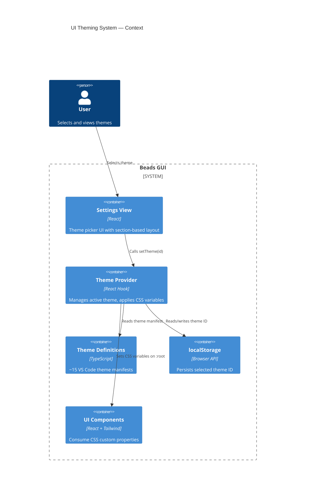
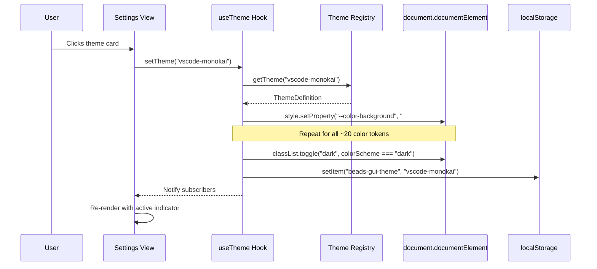
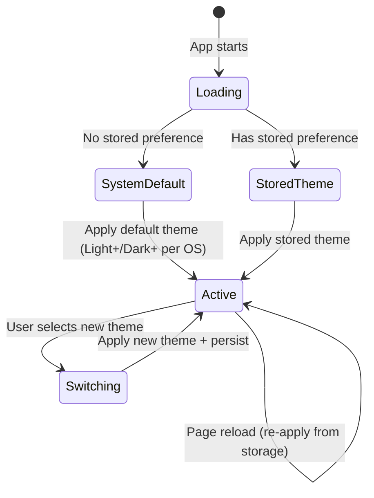

# UI Theming System Specification

## Overview

Replace the binary light/dark mode toggle with a comprehensive theming system that supports all ~15 standard VS Code built-in color themes. Add an extensible Settings screen accessible via sidebar navigation for theme selection and future preferences.

## Domain Glossary

| Term | Definition |
|------|-----------|
| **Theme** | Named set of color token values defining the app's visual appearance |
| **Color token** | Semantic CSS custom property (e.g., `--color-background`) consumed by components |
| **Color scheme** | Binary light/dark classification controlling shadow refinements and `dark:` Tailwind variants |
| **Theme manifest** | TypeScript data structure mapping token names to hex color values for a given theme |
| **Active theme** | The currently selected and visually applied theme |
| **System preference** | OS-level color scheme preference (via `prefers-color-scheme` media query) |

## EARS Requirements

### Ubiquitous (always true)

| ID | Requirement |
|----|------------|
| U1 | The app SHALL render all UI using the active theme's color token values applied as CSS custom properties on the document root. |
| U2 | The active theme selection SHALL persist across page reloads and browser sessions via localStorage. |
| U3 | Each theme SHALL be classified with a color scheme (light or dark) that controls the `.dark` CSS class on the document root. |
| U4 | The Settings screen SHALL be accessible via a "Settings" item in the sidebar navigation with a gear icon. |
| U5 | The Settings screen SHALL use an extensible section-based layout to accommodate future preference categories. |
| U6 | A blocking inline script in `index.html` SHALL read the stored theme from localStorage and apply all CSS custom properties and the `.dark` class before the first paint, preventing flash of unthemed content (FOTC). |
| U7 | In development mode, the app SHALL validate at startup that every registered theme defines a value for every `ColorToken`, logging warnings for any missing tokens. |
| U8 | The Command Palette (Cmd+K) SHALL include a "Switch Theme" command that opens a theme selection list for quick access. |

### Event-driven

| ID | Requirement |
|----|------------|
| E1 | WHEN a user selects a theme from the Settings screen or Command Palette, the app SHALL immediately apply the theme's color tokens to the document root and persist the selection to localStorage. |
| E2 | WHEN the app loads and no theme preference is stored, the app SHALL select a default theme based on the system color scheme preference (Dark+ for dark systems, Light+ for light systems). |
| E3 | WHEN the user navigates to `/settings`, the app SHALL render the Settings view within the AppShell layout. |
| E4 | WHEN the app loads and the stored theme ID does not match any registered theme, the app SHALL treat it as absent and fall back to the system-preference default (E2 behavior). |

### State-driven

| ID | Requirement |
|----|------------|
| S1 | WHILE a theme with color scheme "dark" is active, the app SHALL apply the `.dark` class to `document.documentElement` to enable dark-mode shadow refinements and `dark:` Tailwind variants. |
| S2 | WHILE a theme with color scheme "light" is active, the app SHALL NOT apply the `.dark` class to `document.documentElement`. |
| S3 | WHILE on the Settings screen, the theme picker SHALL visually indicate which theme is currently active. |

### Unwanted

| ID | Requirement |
|----|------------|
| W1 | IF localStorage is unavailable, THEN the app SHALL use the system preference for initial theme selection and function without persistence (no errors shown). |

### Optional

| ID | Requirement |
|----|------------|
| O1 | WHERE the user has enabled reduced motion preferences, theme application SHALL not include transition animations. |

## VS Code Built-in Themes

The following ~15 standard VS Code themes SHALL be available:

### Light Themes (color scheme: light)
1. **Light+ (Default Light)** — VS Code's default light theme
2. **Visual Studio Light** — Classic Visual Studio light
3. **Quiet Light** — Muted, low-contrast light
4. **Solarized Light** — Ethan Schoonover's warm light palette

### Dark Themes (color scheme: dark)
5. **Dark+ (Default Dark)** — VS Code's default dark theme
6. **Visual Studio Dark** — Classic Visual Studio dark
7. **Monokai** — Bold, colorful dark theme
8. **Monokai Dimmed** — Softer Monokai variant
9. **Solarized Dark** — Ethan Schoonover's dark palette
10. **Abyss** — Deep blue dark theme
11. **Kimbie Dark** — Warm, earthy dark palette
12. **Tomorrow Night Blue** — Blue-tinted dark theme
13. **Red** — Dark theme with red accents

### High Contrast Themes
14. **High Contrast Dark** (color scheme: dark) — Maximum contrast dark theme
15. **High Contrast Light** (color scheme: light) — Maximum contrast light theme

## Architecture

### Theme Data Model

```typescript
interface ThemeDefinition {
  id: string;               // e.g., "vscode-dark-plus"
  name: string;             // e.g., "Dark+ (Default Dark)"
  colorScheme: 'light' | 'dark';
  colors: Record<ColorToken, string>;  // token → hex color
}

type ColorToken =
  | 'background' | 'foreground'
  | 'muted' | 'muted-foreground'
  | 'border'
  | 'primary' | 'primary-foreground'
  | 'accent' | 'accent-foreground'
  | 'destructive'
  | 'ring'
  | 'info' | 'info-foreground'
  | 'success' | 'success-foreground'
  | 'warning' | 'warning-foreground'
  | 'danger' | 'danger-foreground'
  | 'surface' | 'surface-raised';
```

### Theme Application Strategy

1. Themes defined as TypeScript objects in `themes/` directory
2. On theme selection: iterate over `colors`, set each as `--color-{token}` on `document.documentElement.style`
3. Toggle `.dark` class based on `colorScheme`
4. Store selected theme `id` in localStorage (key: `beads-gui-theme`)
5. Existing `@theme` block in `index.css` serves as CSS-level fallback defaults
6. Existing `.dark` shadow system continues working via class toggle

### C4 Context Diagram



### Theme Selection Sequence



### Theme State Machine



## Scenario Table

| # | Scenario | Trigger | Expected Behavior | EARS Ref |
|---|----------|---------|-------------------|----------|
| 1 | First visit, dark system | App loads, no stored pref, OS dark | Apply Dark+ theme, set `.dark` class | E2, S1 |
| 2 | First visit, light system | App loads, no stored pref, OS light | Apply Light+ theme, no `.dark` class | E2, S2 |
| 3 | Return visit | App loads, stored theme "monokai" | Apply Monokai theme from storage | U2 |
| 4 | Select theme | Click "Solarized Light" card | Immediately apply Solarized Light, persist, remove `.dark` | E1, S2 |
| 5 | Switch dark→light | Active: Monokai, select: Quiet Light | Remove `.dark`, apply light tokens | E1, S1→S2 |
| 6 | Switch light→dark | Active: Light+, select: Abyss | Add `.dark`, apply dark tokens | E1, S2→S1 |
| 7 | Settings navigation | Click sidebar "Settings" | Render Settings view at `/settings` in AppShell | E3, U4 |
| 8 | Active indicator | On Settings page with Monokai active | Monokai card shows active state | S3 |
| 9 | localStorage unavailable | Storage blocked/private mode | App works with system default, no crash | W1 |
| 10 | Reduced motion | User has `prefers-reduced-motion: reduce` | No transition animation on theme switch | O1 |
| 11 | Page reload persistence | Reload browser | Same theme applied from localStorage | U2 |

## Design Notes

- **`/compound:build-great-things` recommended** for the Settings UI epic — covers IA, component states, accessibility, and layout quality for user-facing preferences screens.
- **Delivery profile**: `webapp` — standard web application with client-side theming.

## File Structure (Proposed)

```
packages/frontend/src/
├── themes/
│   ├── index.ts              # Theme registry (getTheme, getAllThemes, getDefaultTheme)
│   ├── types.ts              # ThemeDefinition, ColorToken types
│   └── definitions/
│       ├── light-plus.ts     # VS Code Light+ (Default Light)
│       ├── dark-plus.ts      # VS Code Dark+ (Default Dark)
│       ├── monokai.ts        # Monokai
│       ├── solarized-light.ts
│       ├── solarized-dark.ts
│       ├── abyss.ts
│       ├── kimbie-dark.ts
│       ├── quiet-light.ts
│       ├── red.ts
│       ├── tomorrow-night-blue.ts
│       ├── monokai-dimmed.ts
│       ├── vs-light.ts       # Visual Studio Light
│       ├── vs-dark.ts        # Visual Studio Dark
│       ├── hc-dark.ts        # High Contrast Dark
│       └── hc-light.ts       # High Contrast Light
├── hooks/
│   └── use-theme.ts          # Refactored: theme ID instead of light/dark
├── views/
│   └── settings-view.tsx     # New settings view
├── components/
│   ├── settings/
│   │   ├── theme-picker.tsx  # Theme selection grid
│   │   └── settings-section.tsx # Reusable section wrapper
│   ├── sidebar.tsx           # Updated: add Settings nav item
│   └── header.tsx            # Updated: remove toggle button
└── app.tsx                   # Updated: add /settings route
```

## Interface Contracts

### Theme Provider ↔ Components (Data-only)
- **Contract**: Components read color values exclusively via CSS custom properties (`var(--color-*)`)
- **Invariant**: All 20 color tokens are always defined on `:root`
- **Breaking condition**: Adding a new required token without defining it in all 15 themes

### Settings View ↔ Theme Provider (Behavioral)
- **Contract**: `setTheme(id: string)` applies theme immediately and persists
- **Invariant**: After `setTheme`, `useTheme().themeId` returns the new ID
- **Breaking condition**: Async theme loading that delays application

### Theme Registry ↔ Theme Definitions (Data-only)
- **Contract**: Each theme file exports a `ThemeDefinition` conforming to the type
- **Invariant**: All themes define values for every `ColorToken`
- **Breaking condition**: Adding a token to `ColorToken` without updating all definitions

### Sidebar ↔ Router (Data-only)
- **Contract**: Settings nav item links to `/settings` route
- **Invariant**: Route renders `SettingsView` within `AppShell`
- **Breaking condition**: Route path mismatch
